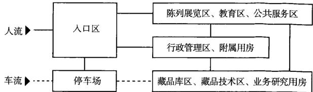
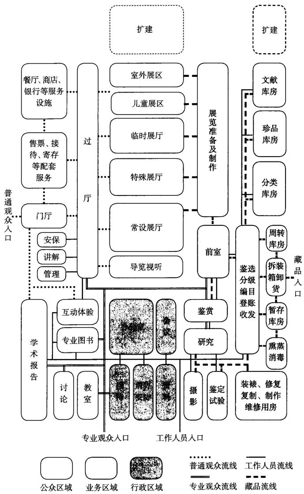
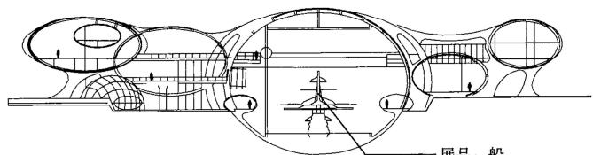
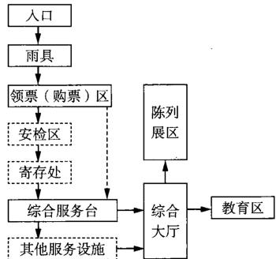
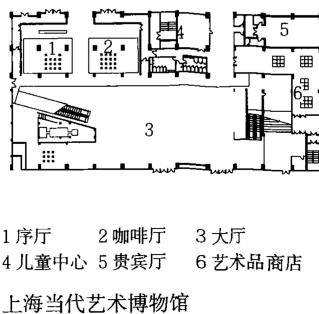
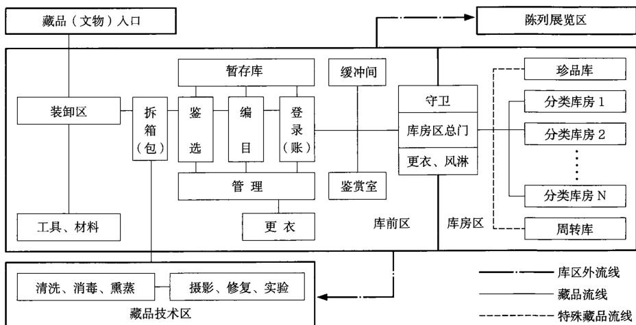
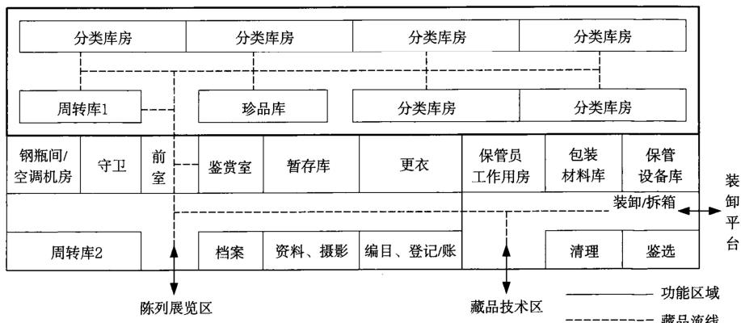
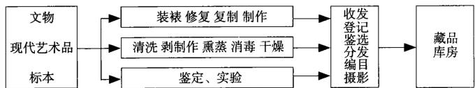
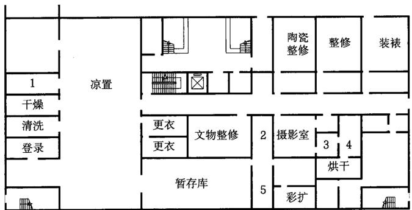
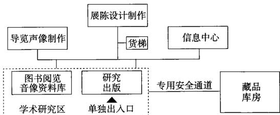

# 博物馆
## 基本概念
### 定义
博物馆是为收藏、研究、保护、展示及传播人类与自然历史、人类成就、自然奇观、社会记忆等所设立的社会服务机构，包括纪念馆、美术馆、科技馆、陈列馆等。
博物馆建筑即为满足博物馆上述功能所建设的空间实体。

### 规模

#### 博物馆建筑规模分类表  
表1  

<table><tr><td>建筑规模类别</td><td>博物馆建筑规模(m2)</td></tr><tr><td>特大型馆</td><td>&gt;50000</td></tr><tr><td>大型馆</td><td>20001~50000</td></tr><tr><td>大中型馆</td><td>10001~20000</td></tr><tr><td>中型馆</td><td>5000~10000</td></tr><tr><td>小型馆</td><td>≤5000</td></tr></table>

注：本表根据《博物馆建筑设计规范》JGJ 66-2015编制。

### 类型

按藏品和基本陈列内容分类，博物馆一般可划为综合类、专题类、艺术类、自然类和科技类五种类型。

#### 博物馆的类型  
表2  

<table><tr><td>编号</td><td>分类</td><td>藏品性质与展品</td><td>实例</td></tr><tr><td>1</td><td>综合类</td><td>综合展示人类、国家、地区、城市及乡村的全面历史进程</td><td>中国国家博物馆、故宫博物院、陕西历史博物馆、天津博物馆、安徽省博物馆、扬州博物馆、大英博物馆、法国卢浮宫博物馆、美国大都会博物馆</td></tr><tr><td>2</td><td>专题类</td><td>专题展示某一历史时期、历史事件、历史人物、历史线索</td><td>侵华日军南京大屠杀遇难同胞纪念馆、广州辛亥革命纪念馆、渡江战役纪念馆、大唐西市博物馆、汉阳陵帝陵外藏坑遗址博物馆、秦始皇陵百戏俑坑遗址博物馆、金沙遗址博物馆、中国科举博物馆、印度泰姬陵、巴黎凯旋门、毛主席纪念堂、鲁迅纪念馆、广岛和平纪念馆、犹太人大屠杀纪念馆</td></tr><tr><td>3</td><td>艺术类</td><td>专题展示古代艺术、工艺美术、当代艺术</td><td>中国美术馆、上海美术馆、陕西美术馆、金陵美术馆、中国工艺美术馆、扬州中国雕版印刷博、碑林博物馆石刻艺术博物馆、山东石刻艺术博物馆、日本美秀美术馆</td></tr><tr><td>4</td><td>自然类</td><td>专题展示自然历史变迁</td><td>北京植物园、华南植物园、北京动物园、上海水族馆、北京水族馆、北京天文馆、英国自然历史博物馆、巴黎国立自然历史博物馆</td></tr><tr><td>5</td><td>科技类</td><td>专题展示人类科技进步、科技成就</td><td>中国航空博物馆、中国铁道博物馆、中国邮电博物馆、上海航海博物馆中国科技馆新馆、上海科技馆、中国航空博物馆、香港太空馆</td></tr></table>

### 选址及用地

博物馆的选址应针对博物馆的类型、规模及城市环境状况综合确定，可以新建，也可以利用旧建筑改造。

作为公共设施，博物馆选址应满足以下基本条件：

1. 交通便利，公用配套设施完备；  
2. 保证安全，远离易燃易爆场所，远离噪声污染源；  
3. 满足功能要求，基地面积应满足博物馆需要，并留有适当发展余地；基地的自然条件、人文环境应与博物馆的性质及功能特征相适应；  
4. 符合城市规划的要求；  
5. 遗址博物馆选址应符合文物保护规划要求。

#### 博物馆建筑经济技术指标统计表  
表3  

<table><tr><td>馆名</td><td>用地面积(m²)</td><td>总建筑面积(m²)</td><td>地上建筑面积(m²)</td><td>地下建筑面积(m²)</td><td>停车位</td><td>容积率</td><td>绿化率</td><td>建筑密度</td></tr><tr><td>中国美术馆</td><td>25700</td><td>106000</td><td>81000</td><td>25000</td><td>300</td><td>3.15</td><td>10%</td><td>62.82%</td></tr><tr><td>首都博物馆</td><td>10155</td><td>61680</td><td>32983</td><td>28697</td><td>304</td><td>1.37</td><td>30.1%</td><td>42.08%</td></tr><tr><td>天津博物馆</td><td>40922</td><td>63956</td><td>43110</td><td>20845</td><td>114</td><td>1.36</td><td>14%</td><td>51%</td></tr><tr><td>安徽省博物馆</td><td>28100</td><td>40430</td><td>38540</td><td>1890</td><td>-</td><td>1.37</td><td>38%</td><td>39.75%</td></tr><tr><td>上海博物馆</td><td>-</td><td>39200</td><td>20982</td><td>18218</td><td>-</td><td>-</td><td>-</td><td>-</td></tr><tr><td>大唐西市博物馆</td><td>14085</td><td>32000</td><td>14850</td><td>17150</td><td>200</td><td>2.3</td><td>30%</td><td>50%</td></tr><tr><td>宁波帮博物馆</td><td>47208</td><td>24107</td><td>20577</td><td>3530</td><td>100</td><td>0.51</td><td>34%</td><td>27%</td></tr><tr><td>扬州中国雕版印刷博物馆和扬州博物馆</td><td>50700</td><td>21238</td><td>21238</td><td>0</td><td>-</td><td>0.42</td><td>47.8%</td><td>15.7%</td></tr><tr><td>汉阳陵帝陵外藏坑遗址博物馆</td><td>24000</td><td>7850</td><td>0</td><td>7850</td><td>100</td><td>0.02</td><td>76.8%</td><td>1.8%</td></tr><tr><td>碑林博物馆石刻艺术博物馆</td><td>4900</td><td>7753</td><td>4736</td><td>3017</td><td>-</td><td>-</td><td>-</td><td>-</td></tr><tr><td>秦始皇陵百戏俑坑遗址博物馆</td><td>5973</td><td>3264</td><td>3264</td><td>0</td><td>-</td><td>0.54</td><td>45%</td><td>54%</td></tr><tr><td>安阳殷墟博物馆</td><td>8960</td><td>3525</td><td>1432</td><td>3525</td><td>-</td><td>-</td><td>76.5%</td><td>16%</td></tr><tr><td>中国科举博物馆</td><td>7402</td><td>17506</td><td>66</td><td>17440</td><td>205</td><td>0.82</td><td>35%</td><td>45%</td></tr></table>

注：本表所列部分博物馆为扩建、加建项目，部分数据并未单独列出。

### 总体布局

1. 博物馆应布局合理、功能分区明确；建筑与景观合理布局；室内展场与室外展场统筹安排；公众、业务、行政三个区域互不干扰、联系方便；新建博物馆建筑的建筑密度不应超过  $40\%$  。  
2. 建筑主要出入口应考虑与城市公共交通顺畅联系；停车场设置应交通便利；内部停车与公众停车宜分开设置，地下停车应避免流线交叉；停车场规模、停车数量应当符合城市规划要求以及博物馆规模要求。  
3. 人流、车流、物流组织应合理；观众出入口应与藏品、展品进出口分开设置；藏品、展品的运输线路和装卸场地应安全、隐蔽，且不应受观众活动的干扰。  
4. 博物馆室外环境景观是博物馆的重要组成部分，应围绕博物馆主题设计安排有利于室外展品的布置，以及公众休憩。  
5. 博物馆布局应当注重安全防范，尽可能不留下死角，不给犯罪分子可乘之机。  
6. 总体布局应考虑博物馆未来发展扩建，近期建设与长远发展相结合，留有备用地。

### 功能构成

不同类型的博物馆其功能构成也不同，但通常包括：收藏、整理、保护、研究、展示、教育、交流与公共服务八项功能。综合博物馆及大型博物馆功能设置较全，专题博物馆及小型博物馆可以侧重于某些方面，功能可以有取舍。

#### 博物馆建筑各区域的功能分区和主要用房组成表  

<table><tr><td rowspan="2">区域分类</td><td rowspan="2" colspan="2">功能区或用房别类</td><td colspan="4">主要用房组成</td></tr><tr><td>历史类、综合类博物馆</td><td>艺术类博物馆</td><td>自然类博物馆</td><td>科技类博物馆</td></tr><tr><td rowspan="5">公众区域</td><td rowspan="2">陈列展览区</td><td>综合大厅、陈列厅、临时展厅、儿童展厅、特殊展厅及其设备间</td><td>综合大厅、陈列厅、临时展厅、儿童展厅、特殊展厅及其设备间</td><td>综合大厅、陈列厅、临时展厅、儿童展厅、特殊展厅及其设备间</td><td>综合大厅、陈列厅、临时展厅、儿童展厅、特殊展厅及其设备间</td><td>综合大厅、陈列厅、临时展厅、儿童展厅、特殊展厅及其设备间</td></tr><tr><td>展具贮藏室、讲解室、管理员室</td><td>展具贮藏室、讲解室、管理员室</td><td>展具贮藏室、讲解室、管理员室</td><td>展具贮藏室、讲解室、管理员室</td><td>展具贮藏室、讲解室、管理员室</td></tr><tr><td>教育区</td><td>影视厅、报告厅、教室、实验室、阅览室、活动室、青少年活动室</td><td>影视厅、报告厅、教室、阅览室、活动室、青少年活动室</td><td>影视厅、报告厅、教室、实验室、阅览室、活动室、青少年活动室</td><td>影视厅、报告厅、教室、实验室、阅览室、活动室、青少年活动室</td><td>影视厅、报告厅、教室、实验室、阅览室、活动室、青少年活动室</td></tr><tr><td rowspan="2">服务设施</td><td>售票室、门廊、门厅、休息室(廊)、饮水、卫生间、贵宾室、广播室、医务室</td><td>售票室、门廊、门厅、休息室(廊)、饮水、卫生间、贵宾室、广播室、医务室</td><td>售票室、门廊、门厅、休息室(廊)、饮水、卫生间、贵宾室、广播室、医务室</td><td>售票室、门廊、门厅、休息室(廊)、饮水、卫生间、贵宾室、广播室、医务室</td><td>售票室、门廊、门厅、休息室(廊) 、饮水、卫生间、贵宾室、广播室、医务室</td></tr><tr><td>茶座、餐厅、商店</td><td>茶座、餐厅、商店</td><td>茶座、餐厅、商店</td><td>茶座、餐厅、商店</td><td>茶座、餐厅、商店</td></tr><tr><td rowspan="7">业务区域</td><td rowspan="2">藏品库区</td><td>库前区</td><td>拆箱间、鉴选室、暂存库、保管员、工作用房、包装、材料库、保管设备库、鉴赏室、周转库</td><td>拆箱间、鉴选室、暂存库、保管员、工作用房、包装、材料库、保管设备库、鉴赏室、周转库</td><td>拆箱间、鉴选室、暂存库、保管员、工作用房、包装、材料库、保管设备库、鉴赏室、周转库</td><td>拆箱间、保管员、工作用房、保管设备库</td></tr><tr><td>库房区</td><td>按藏品材质分类,可包括书画、金属器具、陶瓷、玉石、织绣、木器等库</td><td>按艺术材质分类,可包括书画、油画、雕塑、民间工艺、家具等库</td><td>按学科分哺乳鸟、爬行、两栖、鱼、昆虫、无脊椎动物、植物、古生物类等库,按标本制作方法分浸制、干制标本库</td><td>工程技术产品库、科技产品库、模型库、音像资料库</td></tr><tr><td rowspan="3">藏品技术区</td><td>清洁间、晾置间、干燥间、消毒室</td><td>清洁间、晾置间、干燥间、消毒室</td><td>清洁间、晾置间、冷冻室</td><td rowspan="3" colspan="2">按工艺要求配置</td></tr><tr><td>书画装裱及修复用房、油画修复室、实物修复用房、药品库、临时库</td><td>书画装裱及修复用房、油画修复室、实物修复用房、药品库、临时库</td><td>动物标本制作用房、植物标本制作用房、化石修理室、模型制作室、药品库、临时库</td></tr><tr><td>鉴定实验室、修复工艺实验室、仪器室、材料库、药品库、临时库</td><td>鉴定实验室、修复工艺实验室、仪器室、材料库、药品库、临时库</td><td>生物实验室、仪器室、药品库、临时库</td></tr><tr><td rowspan="2">业务研究用房</td><td>摄影用房、摄影室、展陈设计室、阅览室、资料室、信息中心</td><td>摄影用房、摄影室、展陈设计室、阅览室、资料室、信息中心</td><td>摄影用房、摄影室、展陈设计室、阅览室、资料室、信息中心</td><td>摄影用房、摄影室、展陈设计室、阅览室、资料室、信息中心</td><td>摄影用房、摄影室、展陈设计室、阅览室、资料室、信息中心</td></tr><tr><td>美工室、展品展具制作与维修用房、材料库</td><td>美工室、展品展具制作与维修用房、材料库</td><td>美工室、展品展具制作与维修用房、材料库</td><td>美工室、展品展具制作与维修用房、材料库</td><td>美工室、展品展具制作与维修用房、材料库</td></tr><tr><td rowspan="4">行政区域</td><td rowspan="2">行政管理区</td><td>行政办公室、接待室、会议室、物业管理用房</td><td>行政办公室、接待室、会议室、物业管理用房</td><td>行政办公室、接待室、会议室、物业管理用房</td><td>行政办公室、接待室、会议室、物业管理用房</td><td>行政办公室、接待室、会议室、物业管理用房</td></tr><tr><td>安全保卫用房、消防控制室、建筑设备监控室</td><td>安全保卫用房、消防控制室、建筑设备监控室</td><td>安全保卫用房、消防控制室、建筑设备监控室</td><td>安全保卫用房、消防控制室、建筑设备监控室</td><td>安全保卫用房、消防控制室、建筑设备监控室</td></tr><tr><td rowspan="2">附属用房</td><td>职工更衣室、职工餐厅</td><td>职工更衣室、职工餐厅</td><td>职工更衣室、职工餐厅</td><td>职工更衣室、职工餐厅</td><td>职工更衣室、职工餐厅</td></tr><tr><td>设备机房、行政库房、车库</td><td>设备机房、行政库房、车库</td><td>设备机房、行政库房、车库</td><td>设备机房、行政库房、车库</td><td>设备机房、行政库房、车库</td></tr></table>

注：本表根据《博物馆建筑设计规范》JGJ 66-2015编制。

## 布局与要求
### 流线组织

1. 博物馆交通流线主要由公众参观流线、业务流线以及行政办公流线构成；三种流线应合理组织、避免交叉。

博物馆布局流线图

2. 公众参观流线为博物馆交通主流线，应保证方向明确、整体顺畅。  
3. 业务流线主要考虑博物馆藏品及展品的运输流线，尽可能与其他流线分开设置，保证安全便捷；应考虑藏品及展品装卸场地的停车及装卸要求。

### 陈列与展示

1. 陈列、展示为博物馆的核心功能，一般由常设展厅、临时展厅、室外展场构成；三个区域布局应联系方便，相对独立。  
2. 常设展厅一般由一个或数个展室组成，其空间应满足展品尺寸及数量要求，布局方式应当满足展陈大纲要求，并与参观流线的方向适应。  
3. 临时展厅应能独立布展、撤展。  
4. 室外展场设置应与环境景观相结合。

### 设施与设备

1. 博物馆专用设施与设备包括展陈设施、照明设施、贮藏设施、保护及修复设施、安防设施等；博物馆可根据其属性及规模有所取舍。  
2. 展陈设施主要指展台、展柜及展架等；其选择应考虑展品的特征及展示需要，并保证展品安全。  
3. 虚拟现实及多媒体展示技术日益成为博物馆的重要展示手段，应考虑其应用及设备。  
4. 博物馆采光照明在保证展品的安全前提下，应优先考虑自然光，人工照明灯具应满足展品的照度、高度及光色的要求。  
5. 贮藏设施应针对展品的不同类型进行选择和设计，应满足藏品保存温、湿度及空气质量、防震、防辐射等方面要求。  
6. 安防设施包括防盗、防火和防爆三个方面，应保证展品安全以及公共安全。  
7. 不同类型的博物馆应根据其展藏品的类型建立保护及修复室，购置必要的仪器设备。

### 环境与景观

环境与景观是博物馆的重要组成部分，其设计要求如下：

1. 应满足博物馆交通疏散等其他功能要求；  
2. 应与博物馆的文化主题相一致，有助于公众沉浸于博物馆的文化氛围之中；  
3. 应考虑室外展示需要，设计室外展场；  
4. 应与地方自然环境、景观及物种相适应；  
5. 应与地方文化及周边环境相协调。

### 展陈设计要求

展陈设计是博物馆承载的主体，建筑设计应当围绕展陈设计展开，并考虑以下展陈要素对设计的影响。

1. 功能配比：建筑的功能配比应当符合展陈容量及规模的需要，提供功能匹配、便于使用管理的空间。  
2. 流线：建筑流线组织应基于展陈流线进行设计。  
3. 空间：建筑空间的设计应满足展品尺寸及观赏要求，并结合展陈空间的布局和展示氛围的营造。  
4. 采光：设计需考虑自然光源与人工光环境的综合运用，将建筑采光系统与展陈光环境要求结合设计。  
5. 荷载：除对建筑结构常用荷载的考虑外，应结合展陈的特殊要求（如雕塑、临展等重型展品）进行设计。

## 基本构成
### 建筑功能区域的构成

博物馆的功能按使用范围可以分为公众区域，业务区域，行政区域。功能区域的组成和各类用房的设置应根据博物馆的类型确定。

功能关系图
  

#### 筑功能区域划分及各类用房构成表  

<table><tr><td rowspan="4">公众区域</td><td rowspan="2">陈列区</td><td colspan="2">序厅、过厅、常设展厅、特殊展厅、临时展厅、儿童展厅、导览视听室、室外展区等</td></tr><tr><td colspan="2">展具贮藏室、讲解员室、安保室、管理员室等</td></tr><tr><td>公众服务区</td><td colspan="2">售票、门厅、休息室(廊)、饮水、厕所、清洁室、茶座、餐厅、商店、银行、游戏体验、接待室、信息咨询服务、广播室医务室、寄存、安检等</td></tr><tr><td>研究教育区</td><td colspan="2">研究讨论室、教室、专业图书阅览室、学术报告厅、互动式体验区等</td></tr><tr><td rowspan="3">业务区域</td><td rowspan="2">藏品库区</td><td>库前区</td><td>拆装箱间,包装材料库,暂存库房,周转库房,保管员工作室,保管设备贮藏室,鉴选、分级、编目室等</td></tr><tr><td>藏品库区</td><td>分类库房、珍品库房、文献库房等</td></tr><tr><td>藏品保护技术用房</td><td colspan="2">摄影室、熏蒸消毒室、实验室、文物复制室、标本制作室、书画装裱与修复室、模型(标本)室、研究室、图书档案室等</td></tr><tr><td rowspan="2">行政区域</td><td>行政管理用房</td><td colspan="2">办公室、会议室、值班室、安防消防室、接待洽谈室、资料室等</td></tr><tr><td>设备用房</td><td colspan="2">电梯机房、空调机房、变配电室、冷冻机房、水泵房、车库等</td></tr></table>

### 设计要点

1. 总体设计

(1) 应当充分结合展陈设计进行功能布局。  
(2) 应分区明确，各类用房相对集中，自成系统，同时应考虑各类功能用房之间的联系方便。  
(3)建筑的公众入口、藏品出入口、员工出入口应分开设置，并配备相应的安全监控措施。  
(4) 根据功能分区确定合理流线。参观流线应与展陈流线吻合并保持一定灵活性。公众流线与藏品流线应各自独立，互不影响；服务于公共区域的食品、垃圾等运送路线应避免与藏品流线交叉。  
(5)各类功能布局和空间设计应为内部功能的适度调整和后续扩建提供可能。

2. 公众区域

(1)应当根据展陈设计的要求在建筑中设置多种形式的交通设施，多层的大型馆、特大型馆宜设置自动扶梯或者结合布展设置参观坡道。  
(2)应根据展陈流线提供适当休息区域。陈列区中的休息区域可与公共区域相对独立，做到动静有别。

3. 工作区域

(1) 藏品库区应接近陈列室区域布置, 藏品不宜通过露天运输和在运输过程中经历大的温湿度变化。  
(2)藏品区库可设在地下室、半地下室，因此须有可靠的防水、排水、防潮、除湿等措施。  
(3) 藏品运送通道不应出现台阶, 珍品及对温度敏感的藏品不应露天运送。  
(4) 设备用房与其他功能区相对独立但紧密联系。  
(5) 设备管路的走向应当避免影响展陈布置。

## 陈列展览区
### 陈列展览区功能组成

陈列展览区一般由陈列展览空间、展具贮藏室、讲解员室、管理员室等部分组成。陈列展览空间应根据陈展内容的需要设置，可包括综合大厅、基本陈列厅、临时展厅等，还可因陈展设计或空间组织的需要设置序厅、导览视听室、儿童展厅、特殊展厅等。

### 设计要点

1. 陈列展览区的平面组合应满足展陈内容的系统性、顺序性，以及观众选择性参观的需要；观众流线的组织应尽量避免迂回、交叉、缺漏。  
2. 基本陈列厅应布置在陈列展览区中最醒目便捷的位置。临时展厅由于展览内容需经常更换，设计中宜单独设置，满足独立开放、布展、撤展等要求。  
3. 展厅设计应符合展示目的的需要，符合观众的行为和心理特征；应能满足部分观众抄录、临摹的需要；大、中型展厅应有观众休息区和座椅的设置；设有互动性展品的，应有相应保护措施。有特殊产品的展厅设计应符合展品的尺寸及工艺要求。  
4. 为确保展品不受人为或自然破坏，展厅设计应有相应的实体防护和技术防范措施，并有利于管理人员维护展品安全和参观秩序。  
5. 合理布置讲解员室、管理室、展具储藏室等陈列展览区的附属用房。且与陈列室需要联系方便，便于组织观众参观、净场和展品保卫工作。

#### 陈列展览区平面组合类型示意图  
<table><tr><td>■大厅式
利用大厅综合展出或灵活分隔为小空间</td><td>法国巴黎蓬皮杜艺术文化中心标准层平面图</td><td>美国航空博物馆首层平面图</td></tr><tr><td>■串联式
各陈列展览室相互串联</td><td>1展厅
2报告厅
3中央书院
安阳殷墟博物馆首层平面图</td><td>1展厅
2报告厅
3中央书院
4原有的柏林博物馆
德国柏林犹太人大屠杀纪念馆平面图</td></tr><tr><td>■放射式
各陈列展览室环绕放射枢纽（门厅、庭院、走道等）布置</td><td>1展厅
2中庭
3报告厅
宝鸡青铜器博物馆首层平面图</td><td>1展厅 4办公室
2餐厅 5阳台
3商店
西班牙毕尔巴鄂古根海姆美术馆二层平面图</td></tr><tr><td>■混合式
将上述一种或几种方式进行组合或分区，形成混合的空间布局</td><td>1展厅
2前厅
3陈列展览设计
4库房</td><td>1展厅 5书店
2自助餐馆 6遗址区
3中庭 7丝绸之路
4会议室
广西大唐西市博物馆首层平面图</td></tr></table>

### 一般展厅布置形式

展厅是博物馆的核心空间。根据展品类型的不同可分为一般展品陈列形式、特殊展品陈列等。

一般展厅布置形式  
表1  

<table><tr><td colspan="2">类型</td><td>口袋式</td><td>穿过式</td><td>混合式</td></tr><tr><td colspan="2">基本类型</td><td></td><td></td><td></td></tr><tr><td rowspan="5">陈列布置形式</td><td rowspan="2">单线陈列</td><td></td><td></td><td rowspan="5"></td></tr><tr><td></td><td></td></tr><tr><td rowspan="2">双线陈列</td><td></td><td></td></tr><tr><td></td><td></td></tr><tr><td>三线陈列</td><td></td><td></td></tr></table>

### 特殊展厅布置

博物馆的特殊尺寸展品因一般陈列方式无法满足观展视线要求，需要特殊尺寸的空间进行陈列和布置，并符合展品视距、视角的要求。

  
1 广东阳江海上丝绸之路博物馆剖面示意图  

### 场景式陈列空间要求

场景式陈列是根据陈列内容还原或模拟一个场景，在设计陈列空间之前需要明确还原后的场景尺度。场景式陈列往往还加入声、光、电及多媒体等手段，是新的陈列形式之一。

### 展陈设计要求

1. 应根据展品的性质、类型、数量、特色及展示要求等进行合理的展陈设计，达到烘托展品的目的。  
2. 展陈方法应灵活运用，可兼用数种方法。  
3. 展陈设计应保障展品安全和观众安全，满足展品对于光照、温度、湿度、空气质量、安防等方面的要求。

#### 陈列厅尺寸统计表  

<table><tr><td colspan="2">馆名</td><td>位置</td><td>展览类型</td><td>陈列形式</td><td>开间(m)</td><td>进深(m)</td><td>层高(m)</td><td>面积(m²)</td></tr><tr><td rowspan="4">特大型馆</td><td>首都博物馆</td><td>二层</td><td>基本展厅</td><td>多线陈列</td><td>55</td><td>27</td><td>6</td><td>1485</td></tr><tr><td>天津博物馆</td><td>五层</td><td>文房清供</td><td>单线陈列</td><td>30</td><td>28</td><td>7.5</td><td>830</td></tr><tr><td>安徽省博物馆</td><td>四层</td><td>区域文化展厅</td><td>多线陈列</td><td>31.5</td><td>20</td><td>6.3</td><td>630</td></tr><tr><td>中国美术馆改造装修工程</td><td>二层</td><td>书画专题展厅</td><td>单线陈列</td><td>97.2</td><td>65.7</td><td>7.5</td><td>6386</td></tr><tr><td rowspan="4">大型馆</td><td>大唐西市博物馆</td><td>西安市劳动南路</td><td>土石遗址、出土文物</td><td>展台、展窗</td><td>12</td><td>12</td><td>4.5</td><td>144</td></tr><tr><td>宁波帮博物馆</td><td>二层</td><td>历史综合资料</td><td>单线陈列</td><td>18</td><td>32</td><td>7.5</td><td>576</td></tr><tr><td>扬州双博物馆</td><td>三层</td><td>书画陈列</td><td>多线陈列</td><td>46.6</td><td>19.6</td><td>6.5</td><td>836</td></tr><tr><td>上海博物馆</td><td>一层</td><td>青铜器展厅</td><td>多线陈列</td><td>64</td><td>32</td><td>5.5</td><td>1504</td></tr><tr><td rowspan="4">中型馆</td><td>韩美林艺术馆</td><td>-4m标高层</td><td>基本展厅</td><td>-</td><td>9.3</td><td>18.4</td><td>6</td><td>171</td></tr><tr><td>乐山大佛博物馆</td><td>一层</td><td>基本展厅</td><td>-</td><td>16.5</td><td>19.2</td><td>7.2</td><td>285</td></tr><tr><td>汉阳陵帝陵外藏坑保护展示厅</td><td>主厅</td><td>考古遗址</td><td>遗址展厅</td><td>30</td><td>71</td><td>6</td><td>2130</td></tr><tr><td>碑林博物馆石刻艺术馆</td><td>主厅</td><td>石展品陈列</td><td>石刻陈列</td><td>8.5</td><td>39.6</td><td>7.5~12</td><td>336</td></tr><tr><td rowspan="3">小型馆</td><td>辽宁五女山高句丽遗址博物馆</td><td>首层</td><td>第一展厅</td><td>单线陈列</td><td>27</td><td>15</td><td>4</td><td>400</td></tr><tr><td>安阳殷墟博物馆</td><td>±0.000标高层</td><td>-</td><td>单线陈列</td><td>28.5</td><td>14</td><td>4</td><td>399</td></tr><tr><td>秦始皇陵百戏俑坑展示厅</td><td>秦始皇陵园内</td><td>陶俑、土遗址</td><td>展坑</td><td>25</td><td>54</td><td>5.3</td><td>1484</td></tr></table>

#### 常见陈列品尺寸与视距统计表（单位：m）  

<table><tr><td>陈列方式</td><td>长度</td><td>宽度</td><td>陈列品高度h</td><td>视距d</td><td>d/h</td></tr><tr><td>图板</td><td>-</td><td>1.5 ~ 3.0</td><td>0.6</td><td>1.0</td><td>1.6</td></tr><tr><td>陈列立柜</td><td>1.5 ~ 2.5</td><td>0.4 ~ 1.0</td><td>1.8</td><td>0.4</td><td>0.2</td></tr><tr><td>陈列平柜</td><td>1.0 ~ 1.2</td><td>0.8 ~ 1.2</td><td>1.2</td><td>0.2</td><td>0.19</td></tr><tr><td>中型实物</td><td>1.0 ~ 4.0</td><td>1.0</td><td>2.0</td><td>1.0</td><td>0.5</td></tr><tr><td>大型实物</td><td>-</td><td>-</td><td>5.0</td><td>2.0</td><td>0.4</td></tr></table>

#### 展厅观众合理密度（ $\mathsf{e}_1$ ）与高峰密度（ $\mathsf{e}_2$ ）    

<table><tr><td>编号</td><td>展品特征</td><td>展览方式</td><td>展厅观众合理密度e1(人/㎡)</td><td>展厅观众高峰密度e2(人/㎡)</td></tr><tr><td>I</td><td rowspan="2">设置玻璃橱、柜保护的展品</td><td>沿墙布置</td><td>0.18~0.20</td><td>0.34</td></tr><tr><td>II</td><td>沿墙、岛式混合布置</td><td>0.14~0.16</td><td>0.28</td></tr><tr><td>III</td><td rowspan="2">设置安全警戒线保护的展品</td><td>沿墙布置</td><td>0.15~0.17</td><td>0.25</td></tr><tr><td>IV</td><td>沿墙、岛式、隔板混合布置</td><td>0.14~0.16</td><td>0.23</td></tr><tr><td>V</td><td rowspan="2">无需特殊保护或互动性展品</td><td>展品沿墙布置</td><td>0.18~0.20</td><td>0.34</td></tr><tr><td>VI</td><td>沿墙、岛式、隔板混合布置</td><td>0.16~0.18</td><td>0.30</td></tr><tr><td>VII</td><td colspan="2">展品特征和展览方式不确定(临时展厅)</td><td>-</td><td>0.34</td></tr><tr><td>VIII</td><td colspan="2">展品展示空间与陈列展览区的交通空间无间隔(综合大厅)</td><td>-</td><td>0.34</td></tr></table>

注：1.本表不适于展品占地率大于  $40\%$  的展厅。  
2.计算综合大厅高峰限值M2时，展厅净面积S应按综合大厅中展示区域面积计算。

#### 陈列密度统计表   

<table><tr><td colspan="2">馆名</td><td>展品类型</td><td>藏品件数(件)</td><td>陈列室面积(m2)</td><td>陈列密度(件/m2)</td><td>展品件数(件)</td></tr><tr><td rowspan="4">特大型馆</td><td>首都博物馆</td><td>北京历史+文物收藏</td><td>20万</td><td>27050</td><td>0.21</td><td>5622</td></tr><tr><td>天津博物馆</td><td>天津历史+文物收藏</td><td>20万</td><td>13000</td><td>0.38</td><td>5000</td></tr><tr><td>安徽省博物馆</td><td>安徽历史+文物收藏</td><td>23万</td><td>12170</td><td>0.26</td><td>3200</td></tr><tr><td>中国美术馆改造装修工程</td><td>中国近现代艺术家作品</td><td>10万</td><td>45700</td><td>0.46</td><td>-</td></tr><tr><td rowspan="4">大型馆</td><td>大唐西市博物馆</td><td>土、石遗址,出土文物</td><td>24(其中一个展室)</td><td>144</td><td>0.16</td><td>24</td></tr><tr><td>宁波帮博物馆</td><td>宁波帮历史及综合资料</td><td>3000</td><td>6680</td><td>0.08</td><td>541</td></tr><tr><td>扬州双博物馆</td><td>扬州历史及雕版印刷历史</td><td>雕版20万,其他文物3万</td><td>7774</td><td>0.28</td><td>雕版10万,文物1060</td></tr><tr><td>上海博物馆</td><td>文物收藏</td><td>100万</td><td>12800</td><td>0.32</td><td>-</td></tr><tr><td rowspan="2">中型馆</td><td>韩美林艺术馆</td><td>绘画书法雕塑、民间工艺</td><td>5000</td><td>2400</td><td>0.83</td><td>2000</td></tr><tr><td>碑林博物馆石刻艺术馆</td><td>陈列</td><td>无法计件</td><td>1154</td><td>1/7.7</td><td>150</td></tr><tr><td rowspan="2">小型馆</td><td>安阳殷墟博物馆</td><td>文物</td><td>-</td><td>2400</td><td>0.25</td><td>600</td></tr><tr><td>秦始皇陵百戏俑坑展示厅</td><td>陶俑、土遗址</td><td>20</td><td>1484</td><td>0.01</td><td>20</td></tr></table>

### 空间尺度

1. 跨度：与结构形式和陈列方式等有关。采用单线陈列时，跨度不宜小于  $5.0\mathrm{m}$ ；双线陈列时，跨度不宜小于  $9.0\mathrm{m}$ 。  
2. 柱网布置：为更好地进行陈列布置，陈列厅内最好不设立柱；必须设立柱时，柱距愈大愈好。综合考虑经济性和陈列布置的灵活性，柱距一般不宜小于  $6\sim 9\mathrm{m}$

3. 净高
    (1)展厅净高可按下式确定：

    $$
    h \geqslant a + b + c
    $$

    式中：  $h$  一净高；

    $a$  一灯具的轨道及吊挂空间，宜取  $0.4\mathrm{m}$  
    $b$  一厅内空气流通需要的空间，宜取  $0.7\sim 0.8\mathrm{m}$  
    $c$  —展厅内隔板或展品带高度，取值不宜小于  $2.4\mathrm{m}$  。

    (2)应满足展品展示、安装要求，顶部灯光对展品入射角的要求，以及安全监控设备覆盖面的要求；顶部空调通风口边缘距藏品顶部直线距离不应小于  $1.0\mathrm{m}$ 。

4. 展品内容类型不同、博物馆建筑规模不同的展厅，其空间尺寸差别很大。  
5. 特殊展品的展厅，如大型雕塑、全景画、场景式展厅等，空间尺寸应根据陈列要求设计。

## 公共服务区
### 公众接待服务空间

1. 合理安排普通观众、团体观众、贵宾、集会人员等不同参观人流，设置不同出入口，避免重复交叉。  
2. 应在公众入口处设置门厅、领票（购票）厅、附属房间等，合理安排领票、验票、安检、雨具存放、小件及衣帽寄存、问讯、语音导览器及资料索取、残疾人轮椅及儿童车租用、电话间、邮箱、医务室、播音室等公众接待及服务空间。可根据功能需要，设置团体或贵宾接待室。  
3. 合理安排门厅、综合大厅、序厅等空间的整合与转换，应在水平和垂直两个方向合理组织参观人流，并且方便博物馆内部各部分功能区域的连接。  
4. 门厅、序厅、综合大厅等兼作庆典、礼仪活动、新闻发布会或社会化商业活动等功能空间时，应具有相应的空间尺寸、设施和设备容量，并符合疏散安全的要求。

#### 不同博物馆综合大厅空间尺寸  

<table><tr><td colspan="2">参数
馆名</td><td>形状</td><td>面积
(m²)</td><td>面宽
(m)</td><td>进深
(m)</td><td>高度
(m)</td></tr><tr><td rowspan="4">特大型
馆</td><td>首都博物馆</td><td>矩形</td><td>2000</td><td>39</td><td>50</td><td>34</td></tr><tr><td>天津博物馆</td><td>梯形</td><td>2300</td><td>31</td><td>85</td><td>15</td></tr><tr><td>安徽省博物馆</td><td>方形</td><td>2024</td><td>44</td><td>46</td><td>22</td></tr><tr><td>中国美术馆改造装修工程</td><td>矩形</td><td>2660</td><td>40.5</td><td>65.7</td><td>22.5</td></tr><tr><td rowspan="4">大型馆</td><td>大唐西市博物馆</td><td>T字形</td><td>3500</td><td>21</td><td>78</td><td>18</td></tr><tr><td>宁波帮博物馆</td><td>矩形</td><td>790</td><td>90</td><td>8.75</td><td>13.5</td></tr><tr><td>扬州双博物馆</td><td>扇形</td><td>300</td><td>18</td><td>17</td><td>19.5</td></tr><tr><td>上海博物馆</td><td>方形</td><td>750</td><td>32</td><td>24</td><td>29.5</td></tr><tr><td rowspan="3">中型馆</td><td>韩美林艺术馆</td><td>矩形</td><td>90</td><td>8.1</td><td>11.2</td><td></td></tr><tr><td>乐山大佛博物馆</td><td>不规则</td><td>453</td><td>17.8</td><td>28.8</td><td>16</td></tr><tr><td>碑林博物馆石刻艺术馆</td><td>矩形</td><td>180</td><td>9.9</td><td>18.4</td><td>120</td></tr><tr><td rowspan="2">小型馆</td><td>辽宁五女山高句丽遗址博物馆</td><td>梯形</td><td>127</td><td>9</td><td>●13.5</td><td>-</td></tr><tr><td>秦始皇陵百戏俑坑展示厅</td><td>方形</td><td>105.3</td><td>9</td><td>11.7</td><td>60</td></tr></table>

  
1 博物馆普通观众流程示意图

  
2 公共接待服务及后勤示意图

### 不同博物馆公众服务设施统计表  

<table><tr><td rowspan="2" colspan="2">公众服务设施
馆名</td><td rowspan="2">安检</td><td colspan="2">票务</td><td colspan="12">其他服务设施</td></tr><tr><td>领票
售票</td><td>验票</td><td>问讯</td><td>讲解
员台</td><td>自助
寄存</td><td>人工
寄存</td><td>资料
索取</td><td>轮椅或
儿童车
租借</td><td>雨具
存放</td><td>医务室或
母婴室</td><td>语音室</td><td>语音导览
器租借</td><td>分散/集中</td><td></td></tr><tr><td rowspan="3">特大型馆</td><td>天津博物馆</td><td>●</td><td>●</td><td>●</td><td>●</td><td>●</td><td>●</td><td>●</td><td>●</td><td>●</td><td></td><td>●</td><td></td><td>●</td><td>分散</td><td></td></tr><tr><td>安徽省博物馆</td><td>●</td><td>●</td><td>●</td><td>●</td><td>●</td><td>●</td><td>●</td><td>●</td><td>●</td><td></td><td>●</td><td>●</td><td>●</td><td>分散</td><td></td></tr><tr><td>中国美术馆改造装
修工程</td><td>●</td><td>●</td><td>●</td><td>●</td><td>●</td><td>●</td><td>●</td><td>●</td><td>●</td><td></td><td>●</td><td>●</td><td>●</td><td>分散</td><td></td></tr><tr><td rowspan="4">大型馆</td><td>大唐西市博物馆</td><td>●</td><td>●</td><td>●</td><td>●</td><td>●</td><td>●</td><td>●</td><td>●</td><td>●</td><td>●</td><td>●</td><td>●</td><td>●</td><td>分散</td><td></td></tr><tr><td>宁波帮博物馆</td><td>●</td><td>●</td><td>●</td><td>●</td><td></td><td></td><td>●</td><td>●</td><td></td><td></td><td></td><td></td><td></td><td>集中</td><td></td></tr><tr><td>扬州双博物馆</td><td>●</td><td>●</td><td>●</td><td>●</td><td>●</td><td>●</td><td>●</td><td>●</td><td>●</td><td>●</td><td>●</td><td>●</td><td>●</td><td>分散</td><td></td></tr><tr><td>上海博物馆</td><td>●</td><td>●</td><td>●</td><td>●</td><td>●</td><td></td><td>●</td><td>●</td><td>●</td><td>●</td><td>●</td><td>●</td><td>●</td><td>分散</td><td></td></tr><tr><td rowspan="2">中型馆</td><td>汉阳陵帝陵外藏坑保护展示厅</td><td>●</td><td></td><td>●</td><td>●</td><td>●</td><td></td><td></td><td></td><td></td><td></td><td></td><td>●</td><td>●</td><td>集中</td><td></td></tr><tr><td>碑林博物馆石刻艺术馆</td><td>●</td><td></td><td></td><td>●</td><td>●</td><td></td><td></td><td>●</td><td></td><td>●</td><td></td><td>●</td><td></td><td>分散</td><td></td></tr><tr><td>小型馆</td><td>秦始皇陵百戏俑坑展示厅</td><td>●</td><td></td><td>●</td><td>●</td><td>●</td><td></td><td></td><td>●</td><td></td><td>●</td><td></td><td>●</td><td></td><td>集中</td><td></td></tr></table>

注：●表示该博物馆具有该项公共服务设施。

### 教育空间

1. 根据博物馆教育功能的定位，可设置包括报告厅、视听室、影视厅、教室、实验室、青少年活动室、阅览室等用房。  
2. 教育普及空间应与门厅、中央大厅等联系紧密，或设置独立对外出入口。

#### 博物馆报告厅、影视厅面积调查表  

<table><tr><td colspan="2">馆名</td><td>形状</td><td>面宽(m)</td><td>进深(m)</td><td>面积(m)</td><td>座位数(个)</td></tr><tr><td rowspan="2">特大型馆</td><td>首都博物馆</td><td>椭圆</td><td>21</td><td>24.8</td><td>440</td><td>-</td></tr><tr><td>安徽省博物馆</td><td>矩形</td><td>13</td><td>15</td><td>195</td><td>100</td></tr><tr><td rowspan="3">大型馆</td><td>大唐西市博物馆</td><td>方形</td><td>12</td><td>12</td><td>144</td><td>70</td></tr><tr><td>天津博物馆</td><td>矩形</td><td>21</td><td>29.5</td><td>651</td><td>389</td></tr><tr><td>宁波帮博物馆</td><td>矩形</td><td>15</td><td>20</td><td>301</td><td>282</td></tr><tr><td rowspan="3">中型馆</td><td>乐山大佛博物馆</td><td>梯形</td><td>12(中)</td><td>18.2</td><td>228</td><td>160</td></tr><tr><td>汉阳陵帝陵外藏坑保护展示厅</td><td>矩形</td><td>30</td><td>71</td><td>2130</td><td>60</td></tr><tr><td>碑林博物馆石刻艺术馆</td><td>矩形</td><td>8</td><td>6.8</td><td>50</td><td>20</td></tr><tr><td>小型馆</td><td>秦始皇陵百戏俑坑展示厅</td><td>方形</td><td>9</td><td>11.7</td><td>105.3</td><td>60</td></tr></table>

### 休息商业空间

1. 宜设置咖啡厅、茶室、休息廊等集中休息空间，每层最好设置局部休息空间，实现集中设置与分散设置相结合。  
2. 集中休息空间宜靠近大厅设置，分散休息空间宜布置于展厅过渡处，并要求有良好环境。  
3. 宜设置小卖部、纪念品商店、书店等商业服务空间，商业服务空间也常与休息空间结合布置。  
4. 饮水处、卫生间、母婴室等设施应靠近休息空间布置。

#### 休息商业空间调查表  

<table><tr><td colspan="2">馆名</td><td>茶室</td><td>商店</td><td>书店</td><td>咖啡厅</td><td>小卖部</td><td>餐厅</td></tr><tr><td rowspan="4">超大型馆</td><td>首都博物馆</td><td></td><td>●</td><td></td><td>●</td><td></td><td>●</td></tr><tr><td>天津博物馆</td><td></td><td>●</td><td>●</td><td>●</td><td>●</td><td></td></tr><tr><td>安徽省博物馆</td><td>●</td><td>●</td><td>●</td><td></td><td>●</td><td></td></tr><tr><td>中国美术馆改造装修工程</td><td></td><td>●</td><td>●</td><td>●</td><td></td><td></td></tr><tr><td rowspan="4">大型馆</td><td>大唐西市博物馆</td><td>●</td><td>●</td><td>●</td><td>●</td><td>●</td><td></td></tr><tr><td>宁波帮博物馆</td><td>●</td><td>●</td><td>●</td><td></td><td>●</td><td>●</td></tr><tr><td>扬州双博物馆</td><td></td><td>●</td><td></td><td>●</td><td></td><td>●</td></tr><tr><td>上海博物馆</td><td></td><td>●</td><td>●</td><td>●</td><td></td><td></td></tr><tr><td rowspan="3">中型馆</td><td>韩美林艺术馆</td><td></td><td>●</td><td></td><td></td><td></td><td></td></tr><tr><td>汉阳陵帝陵外藏坑保护展示厅</td><td></td><td>●</td><td>●</td><td></td><td>●</td><td></td></tr><tr><td>碑林博物馆石刻艺术馆</td><td>●</td><td>●</td><td>●</td><td>●</td><td>●</td><td></td></tr><tr><td rowspan="2">小型馆</td><td>安阳殷墟博物馆</td><td></td><td>●</td><td></td><td></td><td></td><td></td></tr><tr><td>秦始皇陵百戏俑坑展示厅</td><td></td><td>●</td><td>●</td><td></td><td></td><td></td></tr></table>

注：●表示该博物馆具有该项休息商业空间。

#### 公众区卫生设施配置标准  

<table><tr><td rowspan="2">设施</td><td colspan="2">陈列展览区</td><td colspan="2">教育区</td></tr><tr><td>男</td><td>女</td><td>男</td><td>女</td></tr><tr><td>大便器</td><td>每60人设1个</td><td>每20人设1个</td><td>每40人设1个</td><td>每13人设1个</td></tr><tr><td>小便器</td><td>每30人设1个</td><td>-</td><td>每20人设1个</td><td>-</td></tr><tr><td>洗手盆</td><td>每60人设1个</td><td>每40人设1个</td><td>每40人设1个</td><td>每25人设1个</td></tr></table>

注：
1. 本表摘自《博物馆建筑设计规范》JGJ 66-2015。  
2. 本表数据未包括商业服务设施。

## 藏品库区
### 组成

藏品库区应由库前区和库房区组成。

藏品库区建筑面积占博物馆总建筑面积的比例要根据藏品实际种类和数量判断，一般在  $10\% \sim 25\%$  之间，且有博物馆规模越大其藏品库区所占比例（后称“占比”）越高的规律；与博物馆类别的关系是，该占比按照历史艺术（文物）类、自然类、现代艺术类和科技馆类的序列呈逐步减小趋势。综合类博物馆的藏品库区占比与历史艺术（文物）类接近。

藏品库区建筑面积应满足现有藏品保管的需要，并应满足藏品增长预期的要求，或预留扩建的余地。

库前区位于库房区总门之外，由拆箱间、暂存库、缓冲间、保管员工作用房、包装材料库、保管设备库、鉴赏室等组成。库房区位于库房区总门之内，由分类库房（储藏间）和运输通道构成，库房（储藏间）宜按藏品材质或学科分类设置。小型馆至少应设有机藏品（字画、服装、书籍及生物标本等）和无机藏品（瓷器、金属器皿、石器等）两类库房，并宜设珍品库房（存放各类具有较高历史、艺术、科学价值的藏品、文献或贵重藏品）。

库房区外墙内侧宜设夹道，除了有防盗及温差缓冲作用外，可与运输通道合并兼用。

周转库可根据需要设置，一般在库房区内接近库房区总门的位置，库前区的暂存库有时也可作为周转库使用。

#### 藏品库的种类 

<table><tr><td>名称</td><td>特点</td></tr><tr><td>有机藏品库</td><td>库房区总门之内；对温湿度有较高要求</td></tr><tr><td>无机藏品库</td><td>库房区总门之内；有温度、洁净度要求</td></tr><tr><td>珍品库</td><td>库房区总门之内；宜单独建造或独立分区，并有更严格的恒温恒湿要求</td></tr><tr><td>周转库</td><td>一般位于库房区总门之内；用于临时存放需周转的藏品，例如预备布展的藏品、或与其他机构进行交换展的藏品</td></tr><tr><td>暂存库</td><td>库房区总门之外，属藏品管理区；为暂时存放尚未清理、消毒的藏品而专设的房间</td></tr><tr><td>半开放式库房/开放式库房</td><td>位于库房区总门之外，藏品库区与普通展区之间；可以与鉴赏室结合设置，供专业人员研究交流使用；也可供普通参观者观察或接触；需分别设置工作人员出入口和有安检设施的观众出入口</td></tr></table>

### 布局方式

藏品库的布局方式应该根据馆藏品特点、用地条件等因素来确定，并以保证藏品安全、便于管理，和与展区及业务研究用房联系方便为原则。藏品库可放在地下，既可以减少对公共区的影响，同时有利于管理和安全防护，但库前区以及体积较大藏品的库房宜放在地面层。几种布局方式见表2。

#### 藏品库布局方式  

<table>
  <thead>
    <tr>
      <th>类型</th>
      <th>实例</th>
    </tr>
  </thead>
  <tbody>
    <tr>
      <td>独立式</td>
      <td>
        1.安阳殷墟博物馆 
        2.成都鹿野苑石刻博物馆 
        3.美国堪萨斯州尼尔森-阿特金斯艺术博物馆 (The Nelson-Atkins Museum of art, Kansas, Mo, USA) 
        4.美国得克萨斯州沃斯堡当代艺术博物馆 (Modern Art Museum of Fort Worth, Texas, USA)
      </td>
    </tr>
    <tr>
      <td>贴临式 (水平)</td>
      <td>
        1.良渚博物馆 
        2.意大利罗马市二十一世纪美术馆 (MAXXI Museum, Rome, Italy) 
        3.宁波帮博物馆
      </td>
    </tr>
    <tr>
      <td>贴临式 (垂直)</td>
      <td>
        1.苏州博物馆 
        2.中央美术学院美术馆 
        3.首都博物馆 
        4.美国纽约市 当代艺术博物馆 (New Museum of Contemporary Art, NY, USA) 
        5.天津博物馆 
        6.安徽省新博物馆 
        7.上海博物馆 
        8.中国美术馆 
        9.大唐西市博物馆
      </td>
    </tr>
    <tr>
      <td>内附式</td>
      <td>
        1.法国梅茨蓬皮杜中心 (Centre Pompidou-Metz, France) 
        2.美国旧金山市德扬博物馆 (De Young Museum, San Francisco, USA) 
        3.贾平凹文学艺术馆
      </td>
    </tr>
    <tr>
      <td>开放式</td>
      <td>
        1.法国民俗博物馆 
        2.加拿大温哥华市UBC人类学博物馆 
        3.美国纽约市大都会艺术博物馆亨利·R·鲁斯美国艺术研究中心 (Henry R. Luce enter for the Study of American Art of Metropolitan Museum of Art, NY, USA)
      </td>
    </tr>
  </tbody>
</table>

  
博物馆藏品库区工作流程图

  
藏品库区平面组织示意图

### 基本要求

1. 藏品库区（尤其是库房区）内应保证藏品运输便捷通畅。通道内不应设置台阶、门槛；当通道为坡道时，坡道的坡度不应大于  $1:20$  。  
2. 收藏对温湿度较敏感的藏品，需加设缓冲间。  
3. 藏品库区前宜设装卸平台或可封闭的装卸间。  
4. 缓冲间可设在库房区总门内或总门前，但管理用房的垂直交通和货运电梯均应设在总门外。  
5. 库前区入口处应布置拆箱（包）间，暂存库宜靠近拆箱（包）间。  
6. 藏品宜按材质或学科分类分间贮藏；每间库房应单独设门；库房的面积、空间尺寸、柱网布置应综合以下因素确定：

    (1) 库房每间面积一般不宜小于  $50\mathrm{m}^2$ ；文物类、艺术类藏品库房以  $80 \sim 150\mathrm{m}^2$  为宜；自然类藏品库房以  $200 \sim 400\mathrm{m}^2$  为宜；  
    (2) 库房的净高应高出保管装具柜顶  $0.4 \mathrm{~m}$  以上，并应不小于  $2.4 \mathrm{~m}$ ；文物类藏品库房以  $2.8 \sim 3.0 \mathrm{~m}$  为宜，现代艺术藏品、自然类藏品库房以  $3.5 \sim 4.0 \mathrm{~m}$  为宜；  
    (3)特大体量藏品、科技类藏品库房的面积和高度应根据藏品实际尺寸和工艺要求确定；  
    (4)珍贵藏品的贮藏应设带有防盗装置的珍品库或专柜。

7. 藏品库房的开间或柱网应与库内保管装具的排列和藏品通道相适应。通道宽度应满足运卸藏品及运输工具通行的需要，并且主通道净宽不小于  $1.2\mathrm{m}$ ，两行装具间净宽不小于  $0.8\mathrm{m}$ 。  
8. 藏品库房的防水要做到六面防护，有条件的可以设置顶板和地板的防水夹层。有积水隐患的房间不应布置在库房区的上层或贴邻位置。与库房区无关的管线应尽量避开库区，尤其不应穿越库房。库房区内不应有空调水管、空气凝结水管穿越，并应防止结露；如设置自动灭火系统，宜采用细水雾灭火系统；如有遇水即损藏品的库房，应设气体灭火系统。

#### 藏品库柜架及运输工具参数表  

<table><tr><td>分类</td><td>名称</td><td>材料</td><td>排列方式</td><td>备注</td></tr><tr><td rowspan="6">藏品柜架</td><td>书画柜</td><td>钢木</td><td rowspan="3">背靠背</td><td rowspan="3">抽屉尺寸根据藏品大小确定</td></tr><tr><td>钱币柜</td><td>钢木</td></tr><tr><td>印章柜</td><td>钢木</td></tr><tr><td>通用柜</td><td>钢木</td><td>背靠背</td><td>双开门,横档可调,根据需要,前后左右相邻两柜可连通</td></tr><tr><td>密集柜</td><td>钢木</td><td>密集排列</td><td>下铺轨道,可移动</td></tr><tr><td>柜架</td><td>钢木</td><td>背靠背</td><td>横档可调,陈列大件藏品</td></tr><tr><td rowspan="6">运输工具</td><td>标准运输箱</td><td rowspan="6">-</td><td rowspan="6">-</td><td>远距离运输时的装具</td></tr><tr><td>手推车</td><td>运输小件藏品可进入库区</td></tr><tr><td>梯子</td><td>带轮子可移动</td></tr><tr><td>叉车</td><td>对成件托盘货物进行装卸、堆垛和短距离运输;可进入库区</td></tr><tr><td>电动平板运输车</td><td>运输较大件藏品;环保清洁、可入库区</td></tr><tr><td>柴油运输车</td><td>运输大件、大量藏品;不能进入库区</td></tr></table>

注：
1. 本表仅包含藏具中的柜架，箱盒、囊匣等不涉及。  
2. 柜体、柜架等宜做成圆角，避免磕碰。柜框一般为铁架（门），搁板宜为天然硬质耐麻木。  
3. 有特殊环境要求的藏品宜专设恒温恒湿柜。

## 技术用房

1. 组成

技术用房按不同博物馆的功能类别分主要有：藏品清洁、晾置、干燥、消毒（熏蒸、冷冻、低氧）用房；装裱、修复、复制及辅助用房；动植物标本制作室及辅助用房；实验室及辅助用房四部分。

1. 基本要求

(1) 各类用房应根据工艺、设备的要求进行设计，并应有一定余量，以适应工艺变化和设备更新的需要。  
(2) 特大型、大型博物馆应专设熏蒸室，宜两面靠外墙，面积不宜小于  $20\mathrm{m}^2$  。建筑构造应密闭，并应设置滤毒装置和独立机械排风系统。中、小型博物馆可设熏蒸柜或熏蒸釜，四周应留出走道，柜前或釜前留出足够的距离便于取放文物，墙面、顶棚和楼地面应宜于清洁。  
(3) 书画装裱及修复用房可包括修复室、装裱间、裱件暂存室、打浆室；修复室、装标间不应有直接日晒，应采光充足、均匀，应有供吊挂、装裱书画的较大墙面，并宜设置空调设备。  
(4) 油画修复室的平面尺寸、净高、电源、通风系统和专业照明等应根据设备和工艺要求设计。  
(5) 实物修复室可包括金石器、漆木器、陶瓷等修复用房及材料工具库；要有良好的采光、照明和通风，设置排气柜和污水处理设施。每间面积宜为  $50\sim 100\mathrm{m}^2$  ，净高不应小于  $3.0\mathrm{m}$  ；金石器修复用房包括翻模砂浇铸室、烘烤间等；漆木器修复用房包括家具、漆器修复室、阴干间、晾晒场地等。  
(6) 动植物标本制作室宜位于地面层并配备露天场地，包含解剖室、鞣制室、制作室和缝合室，具有良好的采光和通风条件，易于清洁，房间注意防水和防腐蚀、易于清洁。  
(7) 实验用房应视博物馆类型和规模确定，可按生物实验室（一般  $20 \sim 30\mathrm{m}^2$ ）、化学实验室、物理实验室的要求设置，面积一般为  $50\mathrm{m}^2$ ，并应配备相应的无菌室、实验仪器贮藏室、药品库、毒品库或易燃易爆品库等，位置应远离库区。  
(8) 藏品保护技术用房应按工艺要求设置带通风柜的通风系统和全室通风系统，通风换气量按实验室的要求计算。

  
技术用房工艺流程图

  
1熏蒸 2资料检索 3上光 4暗室 5药物器材
技术用房平面布置实例

## 业务科研用房

1. 组成

由图书、音像阅览及资料库，摄影用房，信息中心，导览声像制作用房，展陈设计用房，研究、出版用房及展品展具制作维修用房等部分组成。

2. 基本要求

(1) 图书、音像资料库应包括阅览、库房、管理人员办公、复印等功能空间。阅览室应有良好的天然采光和自然通风。  
(2) 摄影室等用房应接近藏品库区布置，走廊及门的宽高应考虑藏品的运输方便；不应有阳光直射，宜朝北或采用人工光照明，人工光源要注意避免灯产生的热量及紫外线对藏品的危害。摄影室层高应满足设备架设与大尺寸藏品摄影的需要。  
(3) 信息中心机房不得与藏品库及易燃易爆物存放场所相邻。  
(4) 展陈设计、制作用房与展厅、藏品库房之间必须有便捷的交通以保证藏品的运送安全，应尽可能靠近货梯排布，净高  $4 \sim 5 \mathrm{~m}$ ，朝北设置，有良好采光。  
(5) 大型、特大型馆的研究、出版用房应自成一区，设置专用接待室供馆内外研究人员使用，并宜设独立出入口。需要从藏品库区提取藏品进行工作的研究室，应设置相关设施；与藏品库区的联系应设专用的安全通道或垂直通道。  
(6) 导览声像制导用房包括闭路电视系统和演播系统。演播系统为录像片制作区域，包括演播室、导控室、编辑室、录音室、资料室等部分，各房间的建筑设计应按工艺设计要求确定。  
(7) 展品展具维修用房应与展厅联系方便，靠近货运电梯。应考虑展品的运输通道尺寸要求，可根据工艺设置排风除尘设备。

  
务科研用房流线图

## 办公用房

1. 组成

由行政管理办公、会议、接待用房，安全保卫用房，职工餐厅、更衣室，设备机房四部分组成。

2. 安全保卫用房要求

(1) 应根据博物馆风险等级和防护级别的不同要求，设置或部分设置以下安全保卫用房：报警控制中心或报警值班室、保卫人员办公室、宿舍（营房）、自卫器具贮藏室、卫生间。大型、特大型馆尚需在重要部位设报警控制室（分控室）。  
(2) 报警控制中心或报警值班室的设置位置及其设计，应根据安全防范的级别及其投资规模确定。报警控制中心宜为专用房间；不能与建筑控制室（BAS）或计算机系统机房合用，与消防中心控制室合用一室时，应取得安全管理部门的同意。

## 常规展示
### 展柜

1. 展示性：展柜的作用是让展品尽可能完美地展示出来。应选择适合展品的尺寸、展示方式和光环境。  
2. 安全性：展柜需要满足消防、安防、防震等要求。防止展品因为火灾、地震、人为等因素而遭到损坏。  
3. 保护性：对于博物馆来说，因为有常展陈列，因此可以在展柜中实现局部物理环境控制，这样可以根据展品特点提供不同的物理环境，也较为节能。  
4. 操作性：博物馆需要经常更换展品，因此需要展柜方便开启。

### 展板

展板分为固定式展板和可移动展板。

## 其他展示
### 实体展

小型实体展示灵活多样，大中型实体展示的技术要点在于展品的运输、组装与放置或固定，其次展台或挂件需预留足够荷载，此外实体展厅还必须可以灵活实现背景更替。

### 雕塑展示

雕塑展示要求有方向性的主光源、射灯或自然光或灯泡，与雕塑成  $20^{\circ} \sim 30^{\circ}$  角照射，另辅以环境光。

根据雕塑尺寸与主题确定展示方式与密度，保障能从各主要面近距离观赏，中小型雕塑尽量设置在人视线高度。

雕塑背景明度与色相宜与雕塑主体形成对比，使展品突出。

### 模型展示

根据展品尺寸、重量确定展示方式。

### 多媒体展示

1. 多媒体展示的技术与类型快速进步，但按其原理可分为投影式和LED屏两类。  
2. 投影式可分为：平面幕、曲面幕、球幕或环幕。  
3. 常用LED单元无缝拼贴技术。其中悬挂式要求屏幕  $8\mathrm{m}^2$  以下， $500\mathrm{kg}$  以下。

## 光环境
### 概述

1. 针对博物馆的基本功能和需求，博物馆的光环境设计要考虑：减少照明对文物的损害；照明系统应具备灵活性以满足不同的展示需求并达到最好的目视效果；照明应营造与主题呼应的气氛，使观赏者获得教育、学习与娱乐的体验。
2. 照明方式
从光的来源上分为人工照明、自然光照明两种。
3. 空间照明的布局
(1) 天然光品质优于人工光。展厅应根据展品特征和展陈设计要求，优先采用天然光。  
(2) 天然光产生的照度应符合博物馆建筑的采光标准值。  
(3) 展厅内不应有直射阳光，采光口应有减少紫外辐射、调节和限制天然光照度值和减少曝光时间的构造措施。  
(4) 应有防止产生直接眩光、反射眩光、映象和光幕反射等现象的措施。  
(5) 当需要补充人工照明时, 人工照明光源宜选用接近天然光色温的光源, 并应避免光源的热辐射损害展品。  
(6) 顶层展厅宜采用顶部采光，采光均匀度不宜小于0.7。  
(7) 对于需要识别颜色的展厅，宜采用不改变天然光光色的采光材料。  
(8) 光的方向性应根据展陈设计要求确定。  
(9) 对于照度低的展厅，其出入口应设置视觉适应过渡区域。  
(10) 展厅室内顶棚、地面、墙面应选择无反光的饰面材料。  
(11) 在展厅的动线设计中应根据不同类别展品的曝光敏感度及自然光在动线中的位置、强度，确定最终展览路线。  
(12) 通过照度规划，使观展人既能享受阳光下观展的自然感受，又能确保敏感展品的保护性需求。

### 空间转换中的暗适应

在展陈照明设计时，应针对毗邻空间的照度或亮度规划做衔接上的考虑。因为当人们从亮环境突然进入暗环境，由于视网膜细胞产生对弱光敏感的视紫红质需要时间，所以需要一定的时间才能慢慢地看清物体，这种现象称为暗适应，在展陈照明中应考虑到这个视觉现象对观展人的影响。

### 二维平面展示照明

展陈照明应从博物馆照明角度考虑布局，在满足不同展品对照明灵活性的要求以外，还需保证该布置在建筑布局中的美感。

### 光源的选择

卤钨光源、金卤光源、光纤灯、荧光灯光源是展陈照明中过去常用到的传统光源。其中以卤钨灯光源的显色性最好；金卤灯光源常用于较高空间的照明；光纤在展柜照明中会过滤掉红外线和紫外线，而将热量和电都隔离在照射空间之外；荧光灯光源常用于营造自然光的观展氛围并可提供基础照明。这些传统光源随着LED等新光源的快速发展正逐渐退出历史舞台。相较于传统光源，LED灯具具有的高寿命、低耗能、较低含量的紫外线及红外线等优势，使其在博物馆、美术馆的应用中占有越来越重要的地位。

#### 陈列室展品照度标准值    

<table><tr><td>类别</td><td>参考平面及其高度</td><td>照度标准值(lx)</td><td>年曝光量(lx·h/y)</td></tr><tr><td>对光特别敏感的展品,如织绣品、国画、水彩画、纸质物品、彩绘陶(石)器、染色皮革、动植物标本等</td><td>展品面</td><td>≤50(色温≤2900K)</td><td>50000</td></tr><tr><td>对光敏感的展品,如油画、不染色皮革、银制品、牙骨角器、象牙制品、竹木制品和漆器等</td><td>展品面</td><td>≤150(色温≤3300K)</td><td>36000</td></tr><tr><td>对光不敏感的展品,如铜铁等金属制品、石质器物、宝石石器、陶瓷器、岩矿标本、玻璃制品、搪瓷制品、珐琅器等</td><td>展品面</td><td>≤300(色温≤4000K)</td><td>-</td></tr></table>

注：本表摘自《博物馆建筑设计规范》JGJ 66-2015。

### 眩光控制

在照明方案设计阶段，应仔细研究布局可能产生眩光的因素，并通过选择有效控制眩光的照明方式及眩光抑制良好的灯具，最大限度地避免眩光对观展人的影响。

## 藏品保护

### 基本要求

1. 藏品保存场所必须采取防止藏品受自然破坏和人为破坏的防护措施。  
2. 防自然破坏的内容包括：温度与相对湿度控制、防污染、防生物危害、防水、防潮、防尘、防微振动、防地震、防雷、防日光和紫外线照射等。防人为破坏的内容包括防火和安全防范设计。  
3. 应综合考虑藏品的性质、藏品的原生状态、外界气候的差异等因素，确定藏品的最佳保存环境和防止自然破坏的措施，并应配备相应的监控设备。

### 温湿度控制

1. 对温湿度敏感藏品的库房、展厅、藏品技术用房等，应设置空气调节设备。  
2. 设置空气调节设备的藏品库房、展厅，其温、湿度应相对稳定，温度的日波动值不应大于  $2\sim 5^{\circ}C$  ，相对湿度的日波动值不应大于  $5\%$  。并应根据藏品材质类别确定最佳保存参数，其相对湿度要求可参照表1的规定。

#### 博物馆藏品保存环境相对湿度标准   

<table><tr><td>藏品材质类别</td><td>相对湿度(%)</td></tr><tr><td>金银器、青铜器、金属币、锡器、铅器、玻璃器等</td><td>0~40</td></tr><tr><td>陶器、瓷器、陶俑、唐三彩、紫砂器、砖瓦等</td><td>40~50</td></tr><tr><td>石器、碑刻、石雕、岩画、玉器、宝石、古生物化石等</td><td>40~50</td></tr><tr><td>彩绘泥塑、壁画、画像石等</td><td>40~50</td></tr><tr><td>书画、纺织品、服装、动植物标本、漆器、木器、象牙等</td><td>50~60</td></tr></table>

注：本表根据《博物馆建筑设计规范》JGJ66-2015编制。

### 防生物危害

1. 藏品保存场所门下沿与楼地面之间的缝隙不得大于  $5\mathrm{mm}$ 。  
2. 藏品库房和陈列室应在通风孔洞应加设防鼠、防虫装置。  
3. 利用非文物的旧建筑改造的博物馆建筑，宜将其地基砖木结构改成石质结构和钢筋水泥材料。建筑物的木质材料应经消毒杀虫处理。

### 防污染控制

1. 藏品保存场所墙体内壁应使用易清洁、易除尘并能增加墙体密封性的材料；铺地材料应防滑、耐磨、消声、无污染、易清洁、具弹性。  
2. 有藏品区域应配备空气净化过滤系统。藏品库房、展厅空气中烟雾灰尘和有害气体浓度限值不宜超过表2的规定。超过规定标准的区域，其通风系统应采取净化措施。对特殊陈列柜应独立安装空气净化设备，防止有害气体及灰尘超浓度限值。对于珍贵文物采用密封除氧充氮技术，创造特殊保存环境。  
3. 固定的保管和陈列装具应表面平整、构造简洁，并应采用环保材料。藏品保存场所室内环境污染物浓度限值应符合藏品保存的要求，并应符合表3的规定。

#### 博物馆藏品存放环境空气质量标准    

<table><tr><td>污染物</td><td>日平均浓度限值(mg/m3)</td></tr><tr><td>二氧化硫</td><td>≤0.05</td></tr><tr><td>二氧化氮</td><td>≤0.08</td></tr><tr><td>一氧化碳</td><td>≤4.00</td></tr><tr><td>臭氧</td><td>≤0.12(1h平均浓度限值)</td></tr><tr><td>可吸入颗粒</td><td>≤0.12</td></tr></table>

注：本表摘自《博物馆建筑设计规范》JGJ 66-2015。

#### 博物馆藏品存放环境污染物浓度限值  

<table><tr><td>污染物</td><td>最高浓度限值 \( \left( {\mathrm{{mg}}/{\mathrm{m}}^{3}}\right) \)</td></tr><tr><td>甲醛</td><td>\( \leq  {0.08} \)</td></tr><tr><td>苯</td><td>\( \leq  {0.09} \)</td></tr><tr><td>氨</td><td>\( \leq  {0.2} \)</td></tr><tr><td>氡</td><td>\( \leq  {200}\mathrm{{BQ}}/{\mathrm{m}}^{3} \)</td></tr><tr><td>总挥发性有机化合物</td><td>\( \leq  {0.5} \)</td></tr></table>

注：本表摘自《博物馆建筑设计规范》JGJ 66-2015。

### 防潮和防水

藏品存放场所均应做好防潮或防水。珍品库、无地下室的首层库房、地下库房必须采取防潮、防水、防结露措施；屋面防水等应为I级；地下室防水等级应为一级。

库房区的楼地面应比库房区外高出  $15\mathrm{mm}$  。当采用水消防时地面应有排水设施，确保库房地面不受水浸。

当藏品库房、展厅等用房设置在地下室或半地下室内时，应设置可靠的地坪排水装置；排水泵应设置排水管单独排至室外，排水管不得产生倒灌现象。

### 防盗

1. 藏品库房不宜开设除门窗外的其他洞口，必开洞时应采取防火、防盗措施。珍品库不宜设窗。门窗的设置应符合安全防范、防火、密闭、防盗、防虫的要求，并采取防紫外线、防盗、防虫等措施。  
2. 藏品库房总门、珍品库房和陈列室应设置安全监视系统和防盗自动报警系统。  
3. 展柜必须安装安全锁，并配备安全玻璃。展柜的照明空间、设备空间、检修空间与展示空间也要有隔离措施，避免内部人员检修时对展品的保管安全造成威胁。

### 消防

1. 珍品库房和一级纸(绢)质文物的展厅，藏品在1万件以上的特大型、大型、大中型、中型博物馆的藏品库房和藏品保护技术室、图书资料库，应设置气体灭火系统。上述规模博物馆的展厅宜采用气体灭火系统，也可采用细水雾灭火系统或自动喷水预作用灭火系统。  
2. 藏品在1万件以下的小型博物馆的藏品库房和藏品保护技术室、图书资料库、展厅，可设置细水雾灭火系统或自动喷水预作用灭火系统，条件许可时有机质地的藏品库房和展厅宜采用气体灭火系统。  
3. 当展厅、藏品库房等场所采用以水为介质的灭火装置时，对陈列有机质地藏品的陈列柜和收藏箱柜，应采用不燃材料且密封严实。

博物馆应合理考虑节能设计、声学设计、智能化设计和安防设计，选用适宜的节能措施，减少噪声与震动，设置合适的智能化系统。

## 节能设计
1. 措施
(1) 选择合理的建筑体型系数，合理设置建筑朝向布局。  
(2)合理利用天然光和自然通风，合理采用建筑遮阳设施。  
(3) 注重设计、施工和运营的全过程统筹和全方位综合。
2. 节能材料和设备
(1) 合理选用建筑外墙及屋面保温隔热材料。注重当地材料的使用。  
(2)合理利用节能型光源与灯具，比如LED和光纤照明。  
(3)合理选定空调冷热源。可采用精密空调展柜（恒温恒湿）减少展厅能耗，根据实际情况选择回收空调排风中的冷热量。  
(4)合理利用节水器具和雨水、中水利用技术。

## 声学设计

1. 博物馆建筑应结合功能分区的要求，将安静区域与嘈杂区域隔离。  
2. 展厅、陈列厅选择有吸声效果的地面、顶棚材料。  
3. 条件许可时，宜将建筑内部的噪声源（如柴油发电机、锅炉房、水泵房等）设置在地下或建筑外。  
4. 建筑设备及技术用房的设备做隔声、隔振处理，减少固体振动与传声。  
5. 泥质、陶瓷、玉器、玻璃等易碎易损文物及展品，应采取防振、减振措施。藏品保护修复室的工作台应稳固防振，离墙摆放。  
6. 公众区域的顶棚或墙面宜做吸声处理。  
7. 公众区域应避免产生声聚焦、回声、颤动回声等声学缺陷。

#### 室内允许室内噪声级  

<table><tr><td>房间名称</td><td>允许噪声级（A声级）（dB）</td></tr><tr><td>录音室、藏品库房等</td><td>≤35</td></tr><tr><td>陈列室、展厅、研究室、行政办公、休息室等</td><td>≤45</td></tr><tr><td>实验室等</td><td>≤55</td></tr></table>

#### 不同房间围护结构的空气声隔声标准和撞击声隔声标准

<table><tr><td rowspan="2">房间类型\围护结构或楼板部位</td><td>空气声隔声标准</td><td>撞击声隔声标准</td></tr><tr><td>隔墙及楼板计权隔声量(dB)</td><td>层间楼板计权标准化撞击声压级(dB)</td></tr><tr><td>有特殊安静要求的房间之间</td><td>≥50</td><td>≥65</td></tr><tr><td>有一般安静要求的房间与产生噪声的展览室、活动室之间</td><td>≥45</td><td>≥65</td></tr><tr><td>有一般安静要求的房间之间</td><td>≥40</td><td>≥75</td></tr></table>

#### 公众区域混响时间  

<table><tr><td>房间名称</td><td>房间体积(m3)</td><td>500Hz混响时间(使用状态,s)</td></tr><tr><td rowspan="5">一般公共活动区域</td><td>200~500</td><td>&lt;0.8</td></tr><tr><td>501~1000</td><td>1.0</td></tr><tr><td>1001~2000</td><td>1.2</td></tr><tr><td>2001~4000</td><td>1.4</td></tr><tr><td>&gt;4000</td><td>1.6</td></tr><tr><td>视听室、电影厅、报告厅</td><td></td><td>0.7~1.0</td></tr></table>

## 智能化系统

智能化系统工程设计由通信网络系统、信息设施系统、公共安全系统、建筑设备管理系统、智能化集成系统构成。

应根据博物馆的建筑规模、使用功能、管理要求、建设投资等实际情况，选择配置相应的智能化系统。

1. 信息系统

    (1) 在公众区域、业务与研究用房、行政管理区、附属用房等处，应设置综合布线系统信息点。  
    (2) 陈列展览区、公众服务区等场所，应设置多媒体信息显示系统、信息查询终端和无障碍信息查询终端。  
    (3) 应设置语音导览系统，支持数码点播或自动感应播放的功能。  
    (4) 宜在陈列展览区、藏品库区的门口设置有线对讲分机或可视对讲分机，满足业务管理的需要。

2. 公共安全系统

    (1) 应符合国家相关博物馆风险等级、安全防护级别及安全防范系统要求的规定。  
    (2) 安全技术防范系统的监控应能适应陈列设计、布展功能调整的需要。  
    (3) 博物馆主入口和各陈列展览区入口宜设置客流分析系统，对观众进行人数统计、客流控制和设备管理。  
    (4) 观众主入口处宜设置防爆安检和体温探测装置，各陈列展览区人口宜设置客流分析系统。  
    (5) 藏品库区、陈列展览区、藏品技术区应设置出入口控制系统，业务与研究用房、行政管理用房、强电间、弱电间宜设置出入口控制系统。  
    (6) 在装卸区、拆包（箱）间及出入库交接场地的展（藏）品停放、交接、进出库区，应有全过程的视频监视。  
    (7) 开式珍贵文物的陈列展览应设置周界报警、双监探测等技术防护措施。

3. 设备监控系统

    (1) 建筑设备管理系统应根据公众服务区、陈列展览区、藏品保护技术区、藏品库房、业务与科技区分别进行控制管理。  
    (2) 应根据观众流量对公众区域的温湿度和新风量进行自动调节，并对空气中二氧化碳、硫化物的含量进行监测。  
    (3) 应具有对熏蒸、清洗、干燥、修复等区域产生的有害气体进行实时监控的功能。  
    (4) 展柜、陈列展览区、藏品库区及技术用房中的修复区，应设置温湿度数据采集点。  
    (5) 宜应对陈列展览区、公众服务区的照明进行自动控制，对光线特别敏感的展区应采用触发照明装置。  
    (6) 藏品库房的电源开关统一安装在藏品库区的藏品库房总门之外。  
    (7) 库房窗应至少设置两层窗扇，采用一层密闭金属窗，缝嵌胶条，减少及阻止库外不合适的干湿空气侵入库内；一层安全防盗窗以备必要时开窗通风换气。窗玻璃应能吸收紫外线，涂刷紫外线吸收剂。  
    (8) 藏品库房、信息中心应设置漏水报警系统。