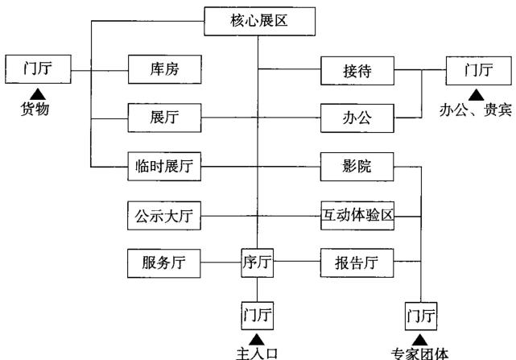
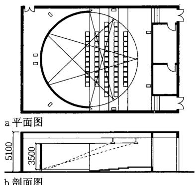

# 城市规划展示馆
## 基本内容
### 定义

城市规划展示馆是以展示城市规划与城市建设的发展、变迁与成就为核心展示内容的博览类建筑。城市规划展示馆具有非营利性，为社会发展服务，向大众开放，以展示、发布、欣赏和教育为目地，具备传播人类城市文明与见证物的功能。在不同的城市和地区，可归纳为该类型建筑的名称还有：城市规划展览馆、城市规划建设展览馆、城市规划展示中心、城市博物馆等。英文名一般翻译为“Urban Planning Exhibition Hall”。

### 功能特征

不同于以展示文物、艺术品、遗迹、自然生物、科学技术、历史事件和历史人物的博物馆、纪念馆或科技馆，城市规划展示馆的展示内容以城市规划历史、城市规划与建设及城市未来发展为核心，同时进行城市规划成果公示、城市重要空间节点及核心建筑群和建筑的展示。展示方式以微缩模型、实物、图片、多媒体、互动影院、虚拟现实等方式为主。

城市规划展示馆建筑设计宜在方案阶段或初步设计阶段就与展陈设计结合。

### 功能构成

主要有四部分内容构成：展示区，互动交流与公共教育区，公共服务区，行政、办公、后勤、仓储区。

#### 各区域功能内容 

<table><tr><td>展示区</td><td>总体规划模型展示区和分类规划建设展示区</td></tr><tr><td>互动交流与公共教育</td><td>互动体验区、多维电影或环幕电影区、场景模拟或复原体验区、报告厅、学术交流室、教室</td></tr><tr><td>公共服务区</td><td>门厅、团体接待、问讯、寄存、咖啡简餐、纪念品销售</td></tr><tr><td>办公后勤仓储区</td><td>办公室、会议室、展品展具制作及修补、库房及临时库房、设备安保用房</td></tr></table>

### 功能流线

  
1 城市规划展示馆功能流线图  

### 各部分区域面积关系

在城市规划展示馆中，总体规划模型展区一般占总建筑面积的  $4\%$  ，个别特大型馆约  $6\% \sim 7\%$  。其余展区相对比较灵活，强调以互动、参与、体验为主的互动交流区占较大比重。行政办公和观众服务区做到科学、合理即可。展品以模型及图片为主，实物较少，对于库房面积、位置朝向、保密措施没有特别要求。

#### 大型城市规划展示馆功能指标建议 

<table><tr><td>功能分区</td><td>面积比例(%)</td><td>主要组成</td></tr><tr><td>展示陈列</td><td>35</td><td>总体规划模型展，城市历史文化展，城市建设成就展，市区县规划展，专项建设展，规划公示</td></tr><tr><td>互动交流</td><td>20</td><td>互动体验区，影院，报告厅，会议室</td></tr><tr><td>观众服务</td><td>10</td><td>售票、问讯、寄存，纪念品销售，接待室，儿童活动书店，餐饮，观众休息，卫生间</td></tr></table>

### 城市规划展示馆的规模

#### 城市规划展示馆分类参照博物馆分类标准  

<table><tr><td>规模</td><td>特大型</td><td>大型</td><td>中型</td><td>小型</td></tr><tr><td>建筑面积(m2)</td><td>大于20000</td><td>20000~10000</td><td>10000~4000</td><td>4000以下</td></tr><tr><td>等级</td><td>直辖市规划展示馆</td><td>省会城市规划展馆</td><td>地方级规划展示馆</td><td>县、区、镇级规划展示馆</td></tr><tr><td>实例</td><td>上海城市规划展示馆</td><td>杭州城市规划展览馆</td><td>宁波城市规划展览馆</td><td>苏州沧浪新城规划展示馆</td></tr></table>

#### 城市规划展示馆规模参数统计表  

<table><tr><td rowspan="2">名称</td><td rowspan="2">占地面积(m2)</td><td rowspan="2">建筑面积(m2)</td><td rowspan="2">展览面积(m2)</td><td colspan="2">层数</td><td rowspan="2">高度(m)</td><td rowspan="2">规模</td></tr><tr><td>地上</td><td>地下</td></tr><tr><td>重庆市规划展览馆</td><td>-</td><td>62000</td><td>30000</td><td></td><td>1</td><td>-</td><td>特大型</td></tr><tr><td>上海城市规划展示馆</td><td>4000</td><td>20670</td><td>7000</td><td>5</td><td>2</td><td>43.3</td><td>特大型</td></tr><tr><td>南京市规划建设展览馆</td><td>23000</td><td>35000</td><td>15500</td><td>3</td><td>-</td><td>-</td><td>特大型</td></tr><tr><td>广州城市规划展览中心</td><td>32523</td><td>84000</td><td>21000</td><td>9</td><td>3</td><td>48.5</td><td>特大型</td></tr><tr><td>大庆城市规划展览馆</td><td>26800</td><td>12500</td><td>-</td><td>3</td><td>-</td><td>-</td><td>特大型</td></tr><tr><td>沈阳市城市规划展览馆</td><td>15000</td><td>25000</td><td>-</td><td>4</td><td>1</td><td>35</td><td>特大型</td></tr><tr><td>烟台市规划展示馆</td><td>12900</td><td>18800</td><td>-</td><td>3</td><td>-</td><td>-</td><td>特大型</td></tr><tr><td>镇江市城市规划展览馆</td><td>15000</td><td>20000</td><td>10000</td><td>4</td><td>1</td><td>-</td><td>大型</td></tr><tr><td>苏州市规划展示馆</td><td>34779</td><td>19868</td><td>6650</td><td>-</td><td>-</td><td>-</td><td>大型</td></tr><tr><td>哈尔滨城乡规划展览馆</td><td>8800</td><td>21000</td><td>-</td><td>4</td><td>-</td><td>-</td><td>大型</td></tr><tr><td>成都规划馆</td><td>16980</td><td>-</td><td>12000</td><td>4</td><td>-</td><td>-</td><td>大型</td></tr><tr><td>北京市规划展览馆</td><td>-</td><td>16000</td><td>8000</td><td>4</td><td>-</td><td>-</td><td>大型</td></tr><tr><td>天津市规划展览馆</td><td>-</td><td>15000</td><td>10000</td><td>4</td><td>-</td><td>-</td><td>大型</td></tr><tr><td>无锡惠山展示中心</td><td>-</td><td>15000</td><td>-</td><td>-</td><td>-</td><td>-</td><td>大型</td></tr><tr><td>石家庄市规划展览馆</td><td>-</td><td>13600</td><td>7000</td><td>3</td><td>-</td><td>-</td><td>大型</td></tr><tr><td>大连城市规划展示馆</td><td>-</td><td>12600</td><td>8800</td><td>3</td><td>-</td><td>-</td><td>大型</td></tr><tr><td>杭州城市规划展览馆</td><td>-</td><td>12000</td><td>-</td><td>4</td><td>-</td><td>-</td><td>大型</td></tr><tr><td>上海崇明规划展示馆</td><td>-</td><td>12000</td><td>-</td><td>4</td><td>-</td><td>-</td><td>大型</td></tr><tr><td>江苏常州规划馆</td><td>-</td><td>9000</td><td>6000</td><td>4</td><td>-</td><td>-</td><td>中型</td></tr><tr><td>厦门城市建设成就馆</td><td>-</td><td>8000</td><td>6000</td><td>2</td><td>-</td><td>-</td><td>中型</td></tr><tr><td>宁波城市规划展览馆</td><td>-</td><td>7400</td><td>-</td><td>4</td><td>-</td><td>-</td><td>中型</td></tr><tr><td>呼和浩特市规划展览馆</td><td>-</td><td>6480</td><td>5000</td><td>3</td><td>-</td><td>-</td><td>中型</td></tr><tr><td>上海松江区规划展示馆</td><td>-</td><td>14000</td><td>6000</td><td>3</td><td>1</td><td>-</td><td>中型</td></tr><tr><td>汉中市规划展览馆</td><td>-</td><td>3000</td><td>-</td><td>-</td><td>-</td><td>-</td><td>小型</td></tr><tr><td>苏州沧浪新城规划展示馆</td><td>17000</td><td>1471.6</td><td>-</td><td>-</td><td>-</td><td>-</td><td>小型</td></tr><tr><td>西安市城市规划展览馆</td><td>-</td><td>2000</td><td>-</td><td>2</td><td>-</td><td>-</td><td>小型</td></tr><tr><td>济南城市规划展览馆</td><td>-</td><td>2000</td><td>-</td><td>1</td><td>1</td><td>-</td><td>小型</td></tr><tr><td>上海杨浦区规划展示馆</td><td>-</td><td>1428</td><td>-</td><td>2</td><td>-</td><td>-</td><td>小型</td></tr><tr><td>新加坡城市规划展览馆</td><td>-</td><td>-</td><td>-</td><td>3</td><td>-</td><td>-</td><td>小型</td></tr><tr><td>澳洲国家首都展示馆</td><td>-</td><td>-</td><td>-</td><td>1</td><td>-</td><td>-</td><td>小型</td></tr></table>

## 总体设计
### 选址原则

1. 特大型、大型规划展览馆选址一般位于城市中心核心区，或新建新城区的中心区域。一般用地位置良好，普遍位于所在地行政中心周边地块或文化、展示建筑用地之中。  
2. 中小型规划展示馆或依附于某些重要公共或文化建筑，例如政府行政中心办公大楼、图书馆等，占据这些建筑的部分体量或局部楼层。  
3. 选址需考虑建筑相互之间的外部空间、交通流线及出入口的协调。  
4. 基地内应有良好的市政配套设施。  
5. 可利用既存建筑改造或扩建。  
6. 交通条件良好，宜位于城市主要道路旁，周边宜靠近地铁站、轻轨站及公交站点，方便参观者到达。

### 设计要点

1. 城市规划展示馆基本为一次实施，独立建造，宜有两个及以上的基地出入口。若与其他建筑合建时，必须满足流线及使用要求，自成一区，单独设置出入口。观众出入口应与展品进出口分开设置。  
2. 建筑密度宜在  $30\% \sim 35\%$  左右，同时应设置有足够的外部空间，以举办户外展览展示、互动活动。  
3. 人流与货物车流不应交叉，场地和道路布置应便于观众参观集散和展品装卸运输，设置有后勤场地，供临时存放、展品转运与后勤停车。  
4. 按照当地停车配比标准，设置足够的机动车与非机动车停车场地。  
5. 建筑宜设置普通参观者、团体参观出入口及VIP观众参观出入口，并设置相应的参观流线。  
6. 展示区一般不超过4层，二层以上展区应考虑展品垂直运输设备。  
7. 一般均以总体规划模型展示空间为核心来组织建筑空间和流线。  
8. 除总体模型展示空间外，其余展厅柱网及层高可参照相关博览类建筑的展厅要求设计。  
9. 注意动静空间分区，空间宜灵动流畅，注意展示空间使用的可变性。  
10. 注重地域特色在建筑设计上的体现。  
11. 注重绿色生态技术和本地建筑材料在设计上的运用。

## 展示区
### 展示区组成

城市规划展示馆展示区主要包括总体规划模型展示区与分类规划展示区。分类规划展示区包括：城市历史文化展览区；城市规划公示展览区；城市建设成就展览区；城市重要建筑模型展览区；城市专项建设展示区；市属区县镇规划展示区；城市建筑文化遗产展览区等。

### 设计要求

1. 总体规划模型展示区宜位于展示区中核心部位，占据展示的主导地位，一般也是展示面积最大的展区。由于需要高大的无柱空间，多位于城市规划展示馆的上部楼层并设置较大层高，一般均做观赏夹层；或占据2层到3层层高，可从本层及上层不同角度观赏总规模型。  
2. 总体规划的模型比例根据城市的辖区范围大小，一般有如下几种比例：1:800、1:750、1:700、1:600等。模型占地面积一般从  $300\mathrm{m}^2$  到  $2000\mathrm{m}^2$  不等。  
3. 总体规划模型展厅一般均配备一个大型多媒体LED或DID拼接屏，与总体规划模型互动。  
4. 部分总体模型可结合大屏幕LED介绍内容上下起伏运动，在土建上宜预留相应的降板区域安放机械装置。  
5. 展厅一般均采用人工光源照明，模型均配有可控的灯光演示系统和多媒体演示系统。  
6. 其他分类展示区部分围绕在总体规划模型周围，按照一定的布展逻辑顺序排列，部分位于其他楼层结合互动与公共教育区布置。城市规划公示展厅通常位于展示区中较为醒目便捷的位置，一般位于底层或二层，方便该部分目的明确的参观者到达。  
7. 人流应组织合理、参观线路应简洁明确，避免迂回交叉；参观宜设多条观展流线：VIP流线，普通流线、专业流线等。  
8. 参观人流宜采用自动扶梯上下，VIP宜设置电梯。  
9. 合理安排休息场所和卫生间，休息场所宜有自然采光及对外自然景观。  
10. 宜按照展陈设计和展品要求进行平面布置。

### 城市规划展示馆总体规划与建设模型展厅尺寸  

<table><tr><td>馆名</td><td>比例(水平)</td><td>比例(垂直)</td><td>面积(m²)</td></tr><tr><td>重庆</td><td>1:750</td><td>-</td><td>892</td></tr><tr><td>上海</td><td>1:500</td><td>-</td><td>约600</td></tr><tr><td>大庆</td><td>-</td><td>-</td><td>2275</td></tr><tr><td>北京</td><td>1:750</td><td>-</td><td>302</td></tr><tr><td>南京</td><td>1:800</td><td>-</td><td>932</td></tr><tr><td>烟台</td><td>1:1000</td><td>-</td><td>1100</td></tr><tr><td>沈阳</td><td>1:1000</td><td>-</td><td>1500</td></tr><tr><td>柳州</td><td>1:750</td><td>-</td><td>约500</td></tr><tr><td>杭州</td><td>1:800</td><td>1:500</td><td>580</td></tr><tr><td>石家庄</td><td>1:800</td><td>-</td><td>1300</td></tr><tr><td>天津</td><td>1:800</td><td>-</td><td>800</td></tr><tr><td>济南</td><td>1:850</td><td>-</td><td>700</td></tr><tr><td>呼和浩特</td><td>1:800</td><td>1:650</td><td>635</td></tr><tr><td>盐城</td><td>1:500</td><td>-</td><td>868</td></tr><tr><td>厦门</td><td>1:1000</td><td>-</td><td>800</td></tr><tr><td>包头</td><td>1:1100</td><td>-</td><td>376</td></tr><tr><td>重庆江津区</td><td>1:1200</td><td>1:1400</td><td>300</td></tr><tr><td>成都</td><td>-</td><td>-</td><td>1400</td></tr><tr><td>大连开发区</td><td>1:750</td><td>-</td><td>1200</td></tr></table>

## 互动区、服务区及办公后勤区
### 基本内容

1. 互动交流与公共教育区：互动体验区，虚拟现实区，4D、3D动感影院、环幕影像厅，多功能报告厅，学术会议室和贵宾接待室。  
2. 公共服务区：门厅，接待兼休息区，售票、问讯、寄存处，书店、纪念品销售区，儿童活动、哺乳室，咖啡简餐或茶室及卫生间。  
3. 办公及后勤服务区：包括馆内管理人员办公区，展品装卸区，展品制作修补及工具间等。

### 设计要点

1. 互动交流区可以围绕展示区参观主线结合布置，穿插进行，增进参观乐趣。互动区通常通过模拟声音、色彩变化、灯光等设备提供感官体验。  
2. 4D、3D动感影院、环幕影像厅的观众视线设计、声学设计、疏散通道设计、座席排列与放映机房、检修通道等应按厂家提供的工艺设计条件并参照《电影院建筑设计规范》JGJ58设计。环幕影像厅一般可选择的投银幕有  $360^{\circ}$  、  $270^{\circ}$  、  $180^{\circ}$  、  $120^{\circ}$  等。根据以往实例统计，城市规划展示馆影厅容量以容纳不超过60人为宜。展馆影厅人数可根据需要及建筑规模来确定。
环幕影院系统的基本构成：环形投影硬幕通常弧幕长  $10\mathrm{m}$  环幕一般  $20\mathrm{m}$  左右，高一般在  $3\mathrm{m}$  上下，投影机选用高流明投影机（分辨率  $1024\times 768$  ，亮度  $45001\mathrm{m}$  以上）、专业图形工作站、控制服务器、影院音响等设备。

3. 临时展厅、团体接待室、兼顾社会文化生活需要或人流量大的报告厅、影视厅等宜设有能独立对外开放的出入口。  
4. 应在公众人口处设置门厅、门廊、售票厅、附属房间等，合理安排售票、验票、安检、雨具存放、小件及衣帽寄存、问讯、语音导览器及资料索取、残疾人轮椅及儿童车租用、电话间、邮箱、医务室、播音室等公众接待及服务空间。需要时可设置团体或贵宾接待室。  
5. 在主入口内外应考虑特殊时段大量人流等候区域，该区域要考虑遮光、挡雨、空气流动及温度调节措施，有条件可设置等候座席，附近宜设置卫生间或可移动厕所。  
6. 城市规划展示馆如条件许可，咖啡简餐宜设置在建筑最高层，方便观赏城市景观。  
7. 展品装卸、制作及修补区宜靠近展示区。货梯吨位、轿厢开间进深及高度应考虑展品运输方便。

  
1  $180^{\circ}$  环幕