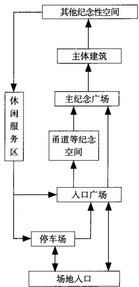
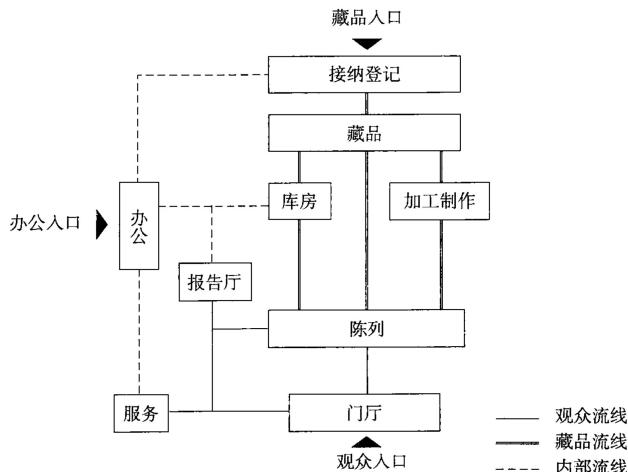

# 纪念馆

## 定义

为纪念特定人物、人群或特定自然、历史事件而建立的，陈列展览与纪念主题相关的实物、图片等展品的建筑物。

纪念馆建筑属于特定类型的博物馆建筑。

### 我国纪念馆在博物馆中所占比重  

<table><tr><td>等级划分</td><td>博物馆总数</td><td>纪念馆总数</td><td>所占比例</td></tr><tr><td>国家一级</td><td>96家</td><td>19家</td><td>约20%</td></tr><tr><td>国家二级</td><td>223家</td><td>30家</td><td>约13%</td></tr><tr><td>国家三级</td><td>406家</td><td>62家</td><td>约15%</td></tr></table>

注：本表数据统计时间截至2014年。

### 分类与分级

1. 纪念馆建筑按照纪念主题可分为人物型和事件型。  
2. 我国纪念馆建筑通常划分为国家级、省级、市级和县级四个等级。每个等级内部又可再细分为不同级别。  
3. 纪念馆建筑规模与级别的关系参见本册博物馆建筑部分。

#### 我国纪念馆的分类  

<table><tr><td></td><td>类型</td><td colspan="2">定义</td><td>实例</td></tr><tr><td rowspan="3">按纪念主题分</td><td rowspan="2">人物型</td><td rowspan="2">纪念已故的、被公众和历史认可的、在某个领域具有杰出成就的人物</td><td>单一人物型</td><td>鲁迅纪念馆、周恩来纪念馆、孙中山故居纪念馆、雷锋纪念馆</td></tr><tr><td>群体人物型</td><td>新四军江南指挥部纪念馆、长春革命烈士纪念馆、中国人民解放军海军诞生地纪念馆</td></tr><tr><td>事件型</td><td colspan="2">纪念、铭记值得后人学习和反思的历史事件和自然事件</td><td>侵华日军南京大屠杀遇难同胞纪念馆、辛亥革命纪念馆、渡江战役纪念馆、汶川大地震震中纪念馆</td></tr></table>

#### 我国国家级纪念馆的分级  

<table><tr><td>等级</td><td>实例</td><td>建筑面积 (m2)</td><td>占地面积 (m2)</td></tr><tr><td rowspan="3">国家一级</td><td>中国甲午战争博物馆</td><td>8900</td><td>10000</td></tr><tr><td>瑞金中央革命根据地纪念馆</td><td>1827</td><td>8084</td></tr><tr><td>侵华日军南京大屠杀遇难同胞纪念馆</td><td>22500</td><td>74000</td></tr><tr><td rowspan="2">国家二级</td><td>中共代表团梅园新村纪念馆</td><td>2278</td><td>1640</td></tr><tr><td>百色起义纪念馆</td><td>5500</td><td>66667</td></tr><tr><td rowspan="2">国家三级</td><td>郑州二七纪念馆</td><td>1923</td><td>6440</td></tr><tr><td>求雨山文化名人纪念馆</td><td>5200</td><td>40000</td></tr></table>

### 设计原则

1. 纪念馆属于特殊类型的博物馆，除了应遵守博物馆类建筑都应遵守的设计原则之外，还应注意建筑设计与环境设计中“纪念氛围”的营造。  
2. 纪念馆的外部空间设计应注意精心组织空间序列，合理引导参观者在参观过程中情绪的变化。  
3. 纪念馆建筑内部空间设计也应注意突出其“纪念性”的特点，在陈列节奏的把握、空间氛围的营造等方面应充分注意参观者的内心感受。  
4. 结合纪念原址建设的纪念馆建筑应充分尊重纪念原址，力求达到建筑与周围环境的和谐共生。  
5. 纪念馆建筑的设计风格应与纪念主体精神内涵相一致，避免过度浪费和浮夸。

### 外部空间功能组成与流线

1. 纪念馆建筑外部空间序列一般由前导空间、过渡空间、主体纪念空间与其他纪念空间几部分组成。相关空间序列的组织应充分考虑与场地地形地貌有机结合。  
2. 纪念馆建筑外部空间一般情况下包括入口广场、主纪念广场、休闲服务区、停车场等部分。  
3. 入口广场一般为空间序列的前导空间，应适当体现纪念主题的空间氛围。  
4. 主纪念广场是外部空间序列上的重点，应注意处理好广场与纪念馆主体建筑以及其他标志性构筑物之间的关系，体现纪念氛围，衬托纪念主体。主纪念广场的面积应考虑集会等纪念活动的需求。  
5. 休闲服务区的设置对应了纪念馆参观活动多样化的需求，其设计应充分注意在风格上与主体建筑的协调统一。  
6. 停车场的设置应充分考虑参观者的停车需求，尤其应注意旅游大巴车对停车空间的特殊需求。条件允许时应设专用的内部停车场。

#### 外部空间功能配置面积表  

<table><tr><td>类型</td><td>名称</td><td>入口广场(m²)</td><td>主纪念广场(m²)</td><td>停车场(m²)</td><td>休闲服务区(m²)</td></tr><tr><td rowspan="4">人物</td><td>徐州李可染艺术中心及纪念馆</td><td>380</td><td>1200</td><td>420</td><td>130</td></tr><tr><td>吴江费孝通江村纪念馆</td><td>480</td><td>1010</td><td>305</td><td>760</td></tr><tr><td>金坛华罗庚纪念馆</td><td>-</td><td>2250</td><td>660</td><td>-</td></tr><tr><td>河池韦拔群纪念馆</td><td>1750</td><td>13200</td><td>2200</td><td>3800</td></tr><tr><td rowspan="13">事件</td><td>合肥渡江战役纪念馆</td><td>7260</td><td>44300</td><td>13370</td><td>15500</td></tr><tr><td>侵华日军南京大屠杀遇难同胞纪念馆</td><td>1685</td><td>3024</td><td>2095</td><td>5360</td></tr><tr><td>青浦陈云故居暨青浦革命历史纪念馆</td><td>310</td><td>2400</td><td>6200</td><td>2000</td></tr><tr><td>辛亥革命纪念馆</td><td>5520</td><td>6200</td><td>8330</td><td>-</td></tr><tr><td>南京渡江胜利纪念馆</td><td>780</td><td>7460</td><td>3850</td><td>1810</td></tr><tr><td>永乐人民抗日游击自卫总队纪念馆</td><td>162</td><td>260</td><td>158</td><td>468</td></tr><tr><td>唐山井陉矿万人坑纪念馆</td><td>506</td><td>760</td><td>825</td><td>1650</td></tr><tr><td>孟良岗战役纪念馆</td><td>526</td><td>6520</td><td>3600</td><td>4880</td></tr><tr><td>平津战役纪念馆</td><td>4540</td><td>9020</td><td>11900</td><td>1170</td></tr><tr><td>汶川大地震震中纪念馆</td><td>-</td><td>2750</td><td>1425</td><td>-</td></tr><tr><td>长春革命烈士纪念馆</td><td>1890</td><td>3575</td><td>1833</td><td>4110</td></tr><tr><td>中国人民解放军海军诞生地纪念馆</td><td>1120</td><td>2500</td><td>300</td><td>-</td></tr><tr><td>武汉辛亥革命纪念馆</td><td>1680</td><td>9940</td><td>8220</td><td>3032</td></tr></table>

  
1纪念馆外部空间功能关系图

## 外部空间
### 纪念馆与纪念原址的关系

纪念原址一般指纪念主体事件的发生场所或者纪念人物的生活工作场所等，其典型实例包括名人故居、名人墓地、历史事件发生现场等。
纪念原址通常是纪念空间的核心价值所在，应该予以重点保护，同时应设法争取最大限度地发挥其纪念效果。
纪念原址不仅限于单独的地点，往往其周围环境也是纪念原址的重要组成部分。纪念原址的保护范围需要综合考虑多方面因素适当确定。
纪念原址在纪念场所中的利用方式包括场景还原、内部空间利用、外部空间利用等。

### 纪念馆与原址关系处理原则

1. 尽最大可能减小纪念馆建筑对于纪念原址的影响和破坏。  
2. 新建纪念馆建筑应充分注意与纪念原址之间的协调。其中包括体量、材料与形式上的协调等。协调包括统一协调和对比协调等多种方法。  
3. 应注意新建纪念馆建筑所带来的人流与车流对纪念原址及其周边的纪念环境产生的影响，设法妥善处理，将不利影响减少到最低。  
4. 纪念空间序列的组织上应该高度重视纪念原址的作用，充分发挥其独有的纪念效果。  
5. 应设法利用纪念馆建筑的兴建带动纪念原址及其周围环境的保护与发展。

### 纪念广场

纪念广场是纪念馆建筑的主要组成部分，由于纪念活动的特殊需要，往往要满足多人集会的需求。纪念广场的面积及其所容纳的活动人数、活动类型等调研数据参见表1。

#### 纪念广场高峰期人均指标统计  

<table><tr><td>项目名称</td><td>广场规模(m2)</td><td>高峰时段容量(人次)</td><td>高峰时段人均占地面积(m2/人)</td></tr><tr><td>平湖李叔同纪念馆</td><td>450</td><td>400</td><td>1.13</td></tr><tr><td>侵华日军南京大屠杀遇难同胞纪念馆</td><td>4500</td><td>15000</td><td>0.30</td></tr><tr><td>南京渡江胜利纪念馆</td><td>7850</td><td>6000</td><td>1.31</td></tr><tr><td>南京雨花台烈士纪念馆</td><td>3050</td><td>15000</td><td>0.20</td></tr><tr><td>南京中山陵孙中山纪念馆</td><td>2100</td><td>1000</td><td>2.10</td></tr><tr><td>长春革命烈士纪念馆</td><td>3630</td><td>10000</td><td>0.36</td></tr><tr><td>辛亥革命纪念馆</td><td>6200</td><td>3000</td><td>2.07</td></tr></table>

注：本表数据通过调研取得，表中所统计的高峰时段多为有组织集会。

### 纪念性标志物与视线分析

纪念碑、主雕塑等纪念性标志物是纪念馆建筑外部空间的重要组成部分。其高度、视距、视角的调查数据参见表2。

#### 标志物的视角实例  

<table><tr><td rowspan="2">主题类型</td><td rowspan="2">项目名称</td><td colspan="2">标志物类型</td><td rowspan="2">标志物高度H(m)</td><td rowspan="2">视距D(m)</td><td rowspan="2">视角a</td><td rowspan="2">高度/视距(H/D)</td></tr><tr><td>纪念碑(塔)</td><td>雕塑</td></tr><tr><td rowspan="4">人物型</td><td>广州孙中山大元帅府</td><td></td><td>●</td><td>7.0</td><td>40.0</td><td>10°</td><td>0.18</td></tr><tr><td>董存瑞烈士陵园</td><td>●</td><td></td><td>14.5</td><td>72.0</td><td>11°</td><td>0.20</td></tr><tr><td>青浦陈云故居暨青浦革命历史纪念馆</td><td></td><td>●</td><td>4.0</td><td>30.0</td><td>7°</td><td>0.13</td></tr><tr><td>梅园新村周恩来陈列馆</td><td></td><td>●</td><td>3.2</td><td>15.0</td><td>12°</td><td>0.21</td></tr><tr><td rowspan="4">群体型</td><td>黄麻起义和郭像皖苏区革命烈士陵园</td><td>●</td><td></td><td>27.1</td><td>110.0</td><td>14°</td><td>0.25</td></tr><tr><td>唐山井陉矿万人坑纪念馆</td><td></td><td>●</td><td>4.0</td><td>48.0</td><td>5°</td><td>0.08</td></tr><tr><td>广州起义烈士陵园</td><td>●</td><td></td><td>45.0</td><td>60.0</td><td>37°</td><td>0.75</td></tr><tr><td>北京人民英雄纪念碑</td><td>●</td><td></td><td>37.9</td><td>220.0</td><td>10°</td><td>0.17</td></tr><tr><td rowspan="4">事件型</td><td>合肥渡江战役纪念馆</td><td>●</td><td></td><td>90.0</td><td>120.0</td><td>37°</td><td>0.75</td></tr><tr><td>南京渡江胜利纪念馆</td><td>●</td><td></td><td>49.4</td><td>120.0</td><td>22°</td><td>0.41</td></tr><tr><td>锦州辽沈战役纪念馆</td><td></td><td>●</td><td>6.0</td><td>115.0</td><td>3°</td><td>0.05</td></tr><tr><td>平津战役纪念馆</td><td>●</td><td></td><td>64.0</td><td>56.0</td><td>49°</td><td>1.14</td></tr></table>

注：●表示有这种标志物类型。

### 纪念馆外部空间地形处理分析

很多纪念馆建筑依靠山体选址，是为了利用场地原有地形地貌，通过高低起伏的地形使纪念馆建筑主体升高或降低，来促进参观者心理感受的变化。场地地形根据基面的抬升和下沉分为平地、凸地形和凹地形三种情况。

## 内部空间
### 功能组成与面积配比

#### 纪念馆内部空间各部分功能组成表  

<table><tr><td>类型</td><td>馆名</td><td>1</td><td>2</td><td>3</td><td>4</td><td>5</td><td>6</td><td>7</td><td>8</td><td>9</td><td>10</td><td>11</td><td>12</td><td>13</td><td>14</td><td>15</td><td>16</td><td>17</td><td>18</td><td>19</td><td>20</td><td>21</td><td>22</td><td>23</td><td>24</td><td>25</td></tr><tr><td rowspan="11">事件型</td><td>长春市烈士纪念馆</td><td>●</td><td></td><td>●</td><td></td><td>●</td><td></td><td></td><td>●</td><td>●</td><td>●</td><td></td><td></td><td></td><td>●</td><td>●</td><td></td><td></td><td>●</td><td></td><td></td><td></td><td></td><td>●</td><td></td><td></td></tr><tr><td>雨花台革命烈士纪念馆</td><td>●</td><td>●</td><td>●</td><td></td><td>●</td><td>●</td><td>●</td><td>●</td><td>●</td><td>●</td><td>●</td><td>●</td><td></td><td>●</td><td>●</td><td></td><td>●</td><td>●</td><td>●</td><td></td><td></td><td></td><td>●</td><td>●</td><td></td></tr><tr><td>镇海口海防纪念馆</td><td>●</td><td></td><td>●</td><td></td><td>●</td><td></td><td></td><td></td><td>●</td><td>●</td><td>●</td><td>●</td><td>●</td><td></td><td></td><td></td><td>●</td><td></td><td></td><td></td><td></td><td>●</td><td>●</td><td></td><td>●</td></tr><tr><td>侵华日军南京大屠杀遇难同胞纪念馆</td><td>●</td><td>●</td><td>●</td><td>●</td><td>●</td><td>●</td><td>●</td><td>●</td><td>●</td><td>●</td><td>●</td><td>●</td><td>●</td><td>●</td><td>●</td><td>●</td><td>●</td><td>●</td><td>●</td><td>●</td><td>●</td><td>●</td><td>●</td><td>●</td><td>●</td></tr><tr><td>中共一大会址纪念馆</td><td>●</td><td></td><td></td><td></td><td>●</td><td></td><td></td><td>●</td><td>●</td><td>●</td><td>●</td><td></td><td></td><td></td><td></td><td></td><td>●</td><td></td><td></td><td></td><td></td><td>●</td><td></td><td></td><td>●</td></tr><tr><td>南京抗日航空纪念馆</td><td>●</td><td></td><td></td><td></td><td>●</td><td>●</td><td>●</td><td>●</td><td>●</td><td>●</td><td>●</td><td></td><td></td><td></td><td>●</td><td></td><td></td><td></td><td></td><td></td><td></td><td>●</td><td>●</td><td></td><td></td></tr><tr><td>辛亥革命纪念馆</td><td>●</td><td>●</td><td>●</td><td>●</td><td>●</td><td>●</td><td>●</td><td>●</td><td>●</td><td>●</td><td></td><td></td><td></td><td>●</td><td>●</td><td></td><td>●</td><td>●</td><td>●</td><td>●</td><td>●</td><td></td><td>●</td><td>●</td><td>●</td></tr><tr><td>武汉辛亥革命纪念馆</td><td>●</td><td></td><td>●</td><td></td><td>●</td><td></td><td></td><td>●</td><td>●</td><td>●</td><td></td><td>●</td><td></td><td>●</td><td></td><td></td><td>●</td><td></td><td></td><td></td><td></td><td>●</td><td>●</td><td>●</td><td></td></tr><tr><td>威海甲午海战纪念馆</td><td>●</td><td></td><td></td><td></td><td>●</td><td>●</td><td></td><td></td><td>●</td><td>●</td><td>●</td><td></td><td></td><td></td><td></td><td></td><td></td><td></td><td></td><td></td><td></td><td>●</td><td></td><td></td><td></td></tr><tr><td>南京梅园新村纪念馆</td><td>●</td><td></td><td></td><td></td><td>●</td><td>●</td><td></td><td>●</td><td>●</td><td>●</td><td></td><td></td><td></td><td></td><td></td><td></td><td>●</td><td></td><td></td><td></td><td></td><td>●</td><td>●</td><td></td><td>●</td></tr><tr><td>汶川大地震中纪念馆</td><td>●</td><td></td><td>●</td><td></td><td>●</td><td>●</td><td></td><td>●</td><td>●</td><td>●</td><td>●</td><td></td><td></td><td></td><td></td><td></td><td>●</td><td></td><td></td><td></td><td></td><td>●</td><td>●</td><td></td><td>●</td></tr><tr><td rowspan="7">人物型</td><td>李可染艺术中心纪念馆</td><td>●</td><td></td><td></td><td></td><td>●</td><td>●</td><td></td><td>●</td><td>●</td><td>●</td><td></td><td></td><td>●</td><td></td><td>●</td><td></td><td></td><td></td><td></td><td></td><td></td><td>●</td><td></td><td></td><td>●</td></tr><tr><td>陈云故居暨青浦革命历史纪念馆</td><td>●</td><td>●</td><td>●</td><td>●</td><td>●</td><td>●</td><td>●</td><td>●</td><td>●</td><td>●</td><td>●</td><td></td><td></td><td>●</td><td>●</td><td>●</td><td>●</td><td>●</td><td></td><td>●</td><td>●</td><td>●</td><td>●</td><td>●</td><td>●</td></tr><tr><td>鲁迅纪念馆</td><td>●</td><td></td><td>●</td><td></td><td>●</td><td>●</td><td></td><td>●</td><td>●</td><td>●</td><td>●</td><td></td><td>●</td><td></td><td></td><td></td><td>●</td><td></td><td></td><td></td><td></td><td>●</td><td>●</td><td></td><td></td></tr><tr><td>平湖李叔同纪念馆</td><td>●</td><td></td><td>●</td><td></td><td>●</td><td>●</td><td>●</td><td></td><td>●</td><td>●</td><td></td><td></td><td></td><td>●</td><td></td><td></td><td>●</td><td></td><td></td><td></td><td></td><td>●</td><td>●</td><td></td><td></td></tr><tr><td>周恩来纪念馆</td><td>●</td><td></td><td></td><td></td><td>●</td><td>●</td><td></td><td></td><td>●</td><td>●</td><td>●</td><td></td><td></td><td></td><td>●</td><td>●</td><td></td><td></td><td></td><td></td><td></td><td>●</td><td></td><td></td><td></td></tr><tr><td>吴健雄纪念馆</td><td>●</td><td></td><td></td><td></td><td></td><td></td><td></td><td></td><td>●</td><td>●</td><td>●</td><td></td><td>●</td><td></td><td></td><td></td><td>●</td><td>●</td><td></td><td></td><td></td><td>●</td><td>●</td><td></td><td></td></tr><tr><td>金坛市华罗庚纪念馆</td><td>●</td><td></td><td></td><td></td><td>●</td><td></td><td></td><td>●</td><td>●</td><td>●</td><td>●</td><td></td><td>●</td><td></td><td></td><td></td><td></td><td></td><td></td><td></td><td></td><td>●</td><td></td><td></td><td></td></tr></table>

注：1 门厅；2 安检区；3 问询台；4 寄存处；5 接待室；6 安保室；7 讲解员室；8 售卖；9 卫生间；10 休息厅；11 序厅；12 冥思厅；13 报告厅；14 会议室；15 影视厅；16 资料室 17 藏品库房；18 史料研究；19 展陈设计；20 出版用房；21 修复室；22 办公室；23 门卫 室；24 游客服务；25 遗址故居。

#### 纪念馆内部空间面积对比表（单位：  $\mathrm{m}^2$  ）  

<table><tr><td>馆名</td><td>门厅</td><td>展厅</td><td>多功能厅</td><td>休息区</td><td>办公用房</td><td>商业</td><td>藏品库区</td></tr><tr><td>上海鲁迅纪念馆</td><td>365</td><td>1710</td><td>250</td><td>165</td><td>860</td><td>0</td><td>300</td></tr><tr><td>金坛市华罗庚纪念馆</td><td>35</td><td>967</td><td>200</td><td>160</td><td>60</td><td>0</td><td>34</td></tr><tr><td>徐州李可染纪念馆</td><td>180</td><td>1310</td><td>106</td><td>65</td><td>170</td><td>41</td><td>0</td></tr><tr><td>周恩来纪念馆</td><td>20</td><td>1237</td><td>1196</td><td>136</td><td>1066</td><td>0</td><td>456</td></tr><tr><td>辛亥革命纪念馆</td><td>268</td><td>6709</td><td>829</td><td>170</td><td>2098</td><td>0</td><td>775</td></tr><tr><td>平湖李叔同纪念馆</td><td>66</td><td>550</td><td>50</td><td>158</td><td>25</td><td>-</td><td>64</td></tr><tr><td>映秀震中纪念馆</td><td>200</td><td>1830</td><td>0</td><td>413</td><td>175</td><td>122</td><td>477</td></tr><tr><td>南京大屠杀遇难同胞纪念馆新馆</td><td>190</td><td>5510</td><td>104</td><td>260</td><td>5565</td><td>-</td><td>660</td></tr><tr><td>吴健雄纪念馆</td><td>130</td><td>545</td><td>275</td><td>50</td><td>150</td><td>-</td><td>70</td></tr><tr><td>新四军江南指挥部纪念馆</td><td>127</td><td>2483</td><td>145</td><td>40</td><td>220</td><td>-</td><td>62</td></tr><tr><td>镇海口海防历史纪念馆</td><td>108</td><td>1184</td><td>177</td><td>160</td><td>276</td><td>-</td><td>0</td></tr><tr><td>雨花台烈士纪念馆</td><td>120</td><td>2437</td><td>195</td><td>637</td><td>440</td><td>-</td><td>440</td></tr><tr><td>长春烈士陵园纪念馆</td><td>234</td><td>2607</td><td>960</td><td>430</td><td>470</td><td>143</td><td>411</td></tr></table>

## 流线组织

1. 纪念馆建筑属于博物馆建筑的范畴，博物馆建筑设计流线组织原则对纪念馆建筑均适用。  
2. 纪念馆建筑内部空间的设计中应该注意通过具体的空间设计来引导参观者的情绪变化。  
3. 纪念馆内部空间序列的组织通常包括序幕、铺陈、高潮、尾声几个部分。其中空间序列的高潮部分是激发参观者相应情感的最高峰环节，设计中应根据纪念主题的要求恰当选择高潮部分的所在位置。  
4. 对于由特殊纪念主题所激发的，有可能对参观者身心造成较为激烈不利影响的情感，设计上应考虑安排相应的空间（例如冥想厅等）对参观者进行情绪上的疏解。

1纪念馆内部功能关系图

## 内部空间
### 序厅

序厅的主要设计要求是通过简练精确的形象语言向观众揭示展览的主题或展览的背景，使观众为参观做好心理预设。

### 冥思厅

冥思厅的设计目的是使参观者在其中平复参观过程中出现的激烈情绪，其空间尺度与材料作法均应服务于这一根本目的。

#### 序厅分析  

<table><tr><td>类型</td><td colspan="3">事件型</td><td colspan="2">人物型</td></tr><tr><td>馆名</td><td>广岛和平纪念馆</td><td>长崎和平纪念馆</td><td>华盛顿犹太人大屠杀纪念馆</td><td>新四军江南指挥部纪念馆</td><td>周恩来纪念馆主馆</td></tr><tr><td>建筑总面积(m2)</td><td>3467</td><td>656</td><td>20155</td><td>4782</td><td>3277</td></tr><tr><td>序厅面积(m2)</td><td>22</td><td>51</td><td>120</td><td>135</td><td>183</td></tr></table>

#### 冥思厅分析  

<table><tr><td>馆名</td><td>镇海口海防历史纪念馆</td><td>长崎和平纪念馆</td><td>华盛顿犹太人大屠杀纪念馆</td><td>以色列犹太人大屠杀纪念馆</td></tr><tr><td>建筑总面积(m2)</td><td>3200</td><td>656</td><td>20155</td><td>4235</td></tr><tr><td>冥思厅面积(m2)</td><td>121</td><td>319</td><td>540</td><td>583</td></tr><tr><td>冥思厅高度(m)</td><td>5</td><td>12</td><td>20</td><td>25</td></tr><tr><td>序厅位置示意图</td><td></td><td></td><td></td><td></td></tr></table>

#### 全景画、半景画展厅分析  

<table><tr><td>类型</td><td colspan="2">全景画展厅</td><td colspan="2">半景画展厅</td></tr><tr><td>馆名</td><td>台儿庄大战纪念馆</td><td>辽沈战役纪念馆</td><td>中国人民抗日战争纪念馆</td><td>鸦片战争海战纪念馆</td></tr><tr><td>建筑总面积(m2)</td><td>6000</td><td>8600</td><td>21000</td><td>7960</td></tr><tr><td>展厅面积(m2)</td><td>3100</td><td>1450</td><td>500</td><td>170</td></tr><tr><td>全景画、半景画展厅位置示意图</td><td></td><td></td><td></td><td></td></tr></table>

### 全景画、半景画展厅

全景画、半景画是指综合运用壁画、实物、塑形、灯光、音响等艺术手段来表现重大历史题材的一种综合造型艺术形式。

全景画、半景画展厅设计中，画面的高度和长度应根据题材内容和画面与观众距离的视觉效果而定。从观众到画面的最佳距离一般为  $13\sim 15\mathrm{m}$  。半景画展厅的视角一般为  $150^{\circ}\sim 180^{\circ}$  。