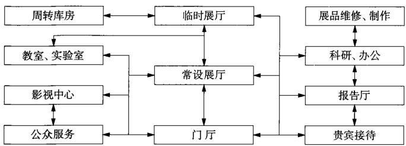

# 科学技术馆
## 基本内容
### 定义

科学技术馆(Science and Technology Museum, 简称科技馆), 是以提高公民科学素质为目的, 面向观众开展科学技术普及与社会化科普教育相关工作和活动的公益性机构。

### 概述

科普教育是现代科技馆的重要职能，它主要由展览教育、实验教育、培训教育组成。

#### 科技馆展示理念  

<table><tr><td>职能</td><td>科普教育为主要职能，收藏、保管、研究为次要职能</td></tr><tr><td>展品</td><td>以人工设计、制作的模型为主；以基本科学原理的解释、应用及高科技为主。强调科学性、知识性、通俗性、趣味性。一般展品对温湿度、光辐射的敏感度较低，可尽可能利用自然光</td></tr><tr><td>展览方式</td><td>利用现代展览技术，以动态展示为主。强调感官，激发思维，侧重现在和未来，鼓励动手、参与式、开放式。寓教于乐、布展自由灵活，适于更新</td></tr><tr><td>活动方式</td><td>可动手操作各种设备（按兴趣随意选择，不受时间、顺序限制），同时举办培训、实验活动、科普讲座、科教电影、科技表演等科普教育活动，出版科普读物</td></tr><tr><td>观众特点</td><td>以青少年为主，并经常为团体参观</td></tr><tr><td>库区</td><td>藏品库区面积较少，以维修、制作展品为主</td></tr></table>

#### 科技馆建筑规模分级参考值  

<table><tr><td>序号</td><td>种类</td><td>规模与面积</td><td>设计使用年限</td></tr><tr><td>1</td><td>特大型馆</td><td>大于40000m2</td><td>宜100年</td></tr><tr><td>2</td><td>大型馆</td><td>20000~40000m2</td><td>宜100年</td></tr><tr><td>3</td><td>中型馆</td><td>8000~20000m2</td><td>50年</td></tr><tr><td>4</td><td>小型馆</td><td>小于8000m2</td><td>50年</td></tr></table>

#### 科技馆主要构成模式   

<table><tr><td>内容</td><td>主要功能</td><td>选址与规模</td></tr><tr><td>大型科学城</td><td>以普及科学技术知识为核心内容,将科学、技术、工业甚至音乐和其他文化艺术活动融为一体的新型文化综合体</td><td>建设规模大、占地大,对自然环境因素要求高,选址向郊区、城市新区发展,位于城市边缘或城市新区行政中心附近,占据优越的地理位置,交通条件方便</td></tr><tr><td>综合科技馆</td><td>综合展示一个国家或地区的科学技术发展历史和水平。展示内容全面,涉及科学技术发展的各个阶段和各个领域,同时收藏有历史价值的科技展品。有全套的辅助配套功能,并拥有科研队伍进行科学研究</td><td>结合城市综合文化设施选址,交通条件方便。形成较好的科学文化氛围,群体效应明显</td></tr><tr><td>专业科技馆</td><td>专业性强,一般为了展示某地区在某一特定领域的科学技术领先优势而建立的科学普及型博物馆</td><td>大、中、小型专业科技馆结合较好的城市自然环境选址,与周围的公园绿地统一规划,环境优雅,对青少年吸引力大</td></tr></table>

### 科技馆总平面设计

根据科技馆的建设规模和和功能要求，结合环境特征，应采取不同的规划布局模式。

#### 科技馆总平面布局特点   

<table><tr><td>种类</td><td>布局特点</td></tr><tr><td>集中式</td><td>主体形象突出，平面布局紧凑，参观流线短</td></tr><tr><td>复合式</td><td>根据科技馆的地形特点和各自功能空间的要求进行有机组合，布局相对集中，各功能空间相对独立</td></tr><tr><td>分散式</td><td>根据不同功能需求分成若干个单体建筑再进行总体规划设计的布局手法</td></tr></table>

## 功能构成

#### 科技馆主要功能用房组成及比例参考值  

<table><tr><td colspan="2">功能用房</td><td colspan="3">百分比(%)</td></tr><tr><td>分类</td><td>房间名称</td><td>特大型馆</td><td>大型馆</td><td>小型馆</td></tr><tr><td>展览教育用房</td><td>常设展厅、短期展厅、序厅、儿童展厅、报告厅、影像厅、培训室、实验室、科普活动室等</td><td>55~60</td><td>60~65</td><td>65~75</td></tr><tr><td>公共服务用房</td><td>大厅、问讯处、休息厅、饮水处、卫生间、商品部、餐饮部、广播室、医务室等</td><td>15~20</td><td>10~15</td><td>5~10</td></tr><tr><td>业务研究用房</td><td>展教育资源室、研究室、图书资料室、技术档案室、声像制作室、展品和材料室、展品制作、维修车间等</td><td>10~15</td><td>10~15</td><td>-</td></tr><tr><td>管理保障用房</td><td>行政办公室、接待室、会议室、安全保卫用房、设备用房等</td><td>10~15</td><td>10~15</td><td>-</td></tr></table>

  
1 科技馆主要平面功能组成及人员流线简图

## 特效电影院设计

1. 特效电影（特种电影）（Special-effect film）

特效电影是指以非常规电影制作手段，采用非常规电影放映系统及观赏形式的电影作品（如环幕、巨幕、球幕、动感及立体电影等）。特效电影建筑主要由观众厅、公共区域、影院设备用房等组成。

2. 特效电影院的总体布局要点

影院宜独立于展厅建造，且宜设置独立出入通道。

特效影院除满足消防疏散要求外，还应设置直达的垂直电梯或自动扶梯。应合理组织交通路线，并应均匀布置安全出口、内部和外部的通道，进出场人流应避免交叉和逆流。

## 展览内容

根据联合国教科文组织《科学技术博物馆建设标准》，主要展览内容建议有：数学、天文、动力、电技术、运输等基础学科。针对我国科学技术领域、经济发展和社会进步有重大意义的内容建议有：生命科学、环境科学、信息科学、能源、交通、材料科学、制造技术、航天、激光技术等。

展品——向观众展示的实物、模型、演示装置等。