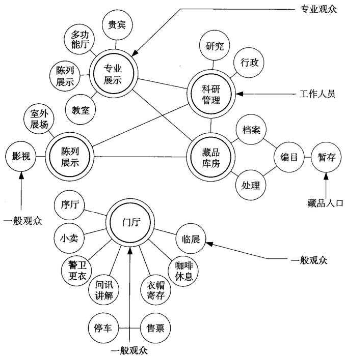
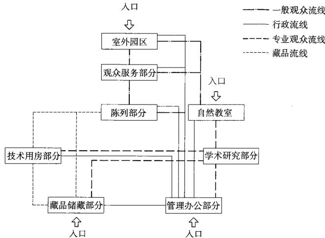
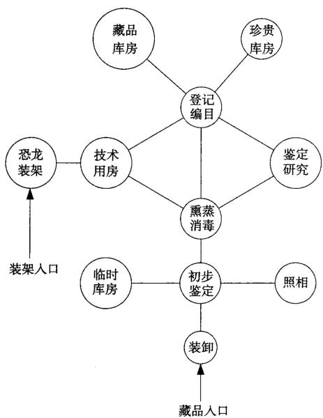

# 自然博物馆
## 基本概念与选址布局
### 定义

自然博物馆(Museum of Natural History)，或称自然史博物馆，是一类收集和研究生物学、古生物学、人类学、地质学标本以及标本赋存环境资料的博物馆。

### 类型

根据藏品内容将自然博物馆分为综合性自然博物馆、专门性自然博物馆、苑囿性自然博物馆三大类。

### 选址

自然博物馆的选址因博物馆的主题及城市环境状况而定。综合性自然博物馆，特别是利用旧建筑改造的自然博物馆大多数位于市中心，专门性和苑囿性自然博物馆通常位于郊区。

#### 自然博物馆分类    

<table><tr><td>自然博物馆分类</td><td>特征</td><td>实例</td></tr><tr><td>综合性自然博物馆</td><td>包括社会历史和自然科学两大类内容。综合性自然博物馆建筑由于藏品杂、学科多、规模大，为使各学科互不干扰而要求分区布局、自成一体</td><td>美国自然历史博物馆,英国自然历史博物馆,日本茨城县自然博物馆,中国北京、天津、上海、重庆、浙江、大连、吉林、西安、台中等综合性自然博物馆</td></tr><tr><td>专门性自然博物馆</td><td>指收藏陈列某一专门自然学科门类藏品的博物馆,如地质、生物、天文等。专门性自然博物馆涵盖的范围非常广泛,建筑设计侧重点也各不相同</td><td>中国地质博物馆、南京古生物博物馆、自贡恐龙博物馆、青岛水族馆、香港海洋公园、国家动物博物馆、北京天文馆等</td></tr><tr><td>苑囿性自然博物馆</td><td>苑囿性自然博物馆多指陈列活生物的植物园、动物园、国家公园与自然保护区等,成规模的实体建筑较少</td><td>澳洲昆士兰植物园、中国秦岭国家植物园等</td></tr></table>

#### 自然博物馆布局方式分类    

<table><tr><td>自然博物馆分类</td><td>特征</td><td>实例</td></tr><tr><td>依附风景区和公园的自然博物馆</td><td>以成熟的公园和园林为主体，通过自然博物馆的建设提升公园的文化内涵，结合良好的环境使其成为多功能的文化设施</td><td>日本茨城县自然博物馆</td></tr><tr><td>“馆”与“园”融合的自然博物馆</td><td>依附园林和公园的自然博物馆在设计之初就对自然博物馆和园区进行整体规划，并且园区的功能设施与自然博物馆功能两者融合，形成互补</td><td>台中自然科学博物馆</td></tr><tr><td>自然博物馆建筑的公园化</td><td>基地往往位于城市中心地带，建筑用地相对紧张，难以提供室外环境。在这样的条件下采取的设计策略是建筑公园化</td><td>上海自然博物馆</td></tr><tr><td>城市中心地带的自然博物馆</td><td>在城市的中心地带修建自然博物馆有利于观众前往参观。这一类型的自然博物馆又可以分为新建博物馆和对既有建筑进行改造形成的博物馆</td><td>英国自然历史博物馆</td></tr></table>

1. 依附风景区和公园的自然博物馆（日本茨城县自然博物馆）
2. “馆”与“园”融合的自然博物馆（台中自然科学博物馆）
3. 自然博物馆建筑的公园化（上海自然博物馆）  
4. 城市中心地带的自然博物馆（英国自然历史博物馆）

## 功能构成

自然博物馆的使用功可能归纳为收藏修复、科研办公、展示陈列、科普教育和游乐服务五大类。

#### 自然博物馆功能空间组成及特点  

<table><tr><td>使用功能</td><td>组成部分</td><td>作用</td><td>特点</td></tr><tr><td>收藏修复</td><td>藏品贮藏、技术用房</td><td>贮藏和修复藏品</td><td>这两部分集中设置</td></tr><tr><td>展示陈列</td><td>陈列厅</td><td>陈列展品和服务观众</td><td>博物馆建筑的主体</td></tr><tr><td>科研办公</td><td>行政办公科学研究设备用房</td><td>提供服务管理和技术支撑</td><td>单独出入口，不对外开放</td></tr><tr><td>科普教育</td><td>科普教室</td><td>服务青少年</td><td>独立流线，闭馆仍能使用</td></tr><tr><td>游乐服务</td><td>纪念品销售、餐饮、室外展场</td><td>服务观众</td><td>获取经济效益的重要途径</td></tr></table>

#### 国内新建自然博物馆功能区面积构成比例  

<table><tr><td>博物馆</td><td>总建筑面积(万㎡)</td><td>陈列区</td><td>库房区</td><td>业务用房及其他</td><td>观众服务设施</td></tr><tr><td>上海自然博物馆</td><td>4.5</td><td>37%</td><td>21%</td><td>16%</td><td>26%</td></tr><tr><td>重庆自然博物馆</td><td>3</td><td>48%</td><td>18%</td><td>16%</td><td>18%</td></tr><tr><td>浙江自然博物馆</td><td>2.6</td><td>44%</td><td>19%</td><td>12%</td><td>25%</td></tr><tr><td>天津自然博物馆</td><td>3.5</td><td>40%</td><td>-</td><td>-</td><td>-</td></tr><tr><td>吉林自然博物馆</td><td>1.47</td><td>40%</td><td>20%</td><td>12%</td><td>21%</td></tr><tr><td>大连自然博物馆</td><td>1.5</td><td>66%</td><td>-</td><td>-</td><td>-</td></tr><tr><td>赣州自然博物馆（在建）</td><td>2.8</td><td>45%</td><td>17%</td><td>14%</td><td>24%</td></tr></table>

## 流线分析

在设计时，应主要考虑对外和对内两种类型的四条流线。

外部和内部四条流线在设计时，应尽量分开、避免交叉，都应有各自独立的出入口。现代自然博物馆各流线之间也已转化为互相穿插，各类空间不再只是单一功能，多功能的复合空间成为一种新的趋势。

  
1 自然博物馆各功能空间的逻辑关系图

1. 外部流线
观众流线：主要包括进入博物馆参观的观众流线，和不参观展品只使用博物馆一些对外服务设施如教室、餐饮、商店等的公众流线。
专业观众流线：主要指到博物馆进行研究、学习、深造的专业人员的流线。

2. 内部流线
藏品流线：主要是指藏品的货运、修复、鉴定、整理和展出流线。
行政流线：主要是指工作人员以及技术人员的流线。

2 自然博物馆建筑流线分析图

## 展示方式

自然博物馆展示对象是以青少年为主的观众群体，现今自然博物馆已根据青少年观众的特点改变了传统展陈观念，变传统的以物为中心的“静态展示”为以人为中心的“静态与动态相结合的展示”。因此自然博物馆与观众的互动性、参与性、娱乐性以及展示所涉及的科技含量通常比其他类型博物馆要高。

#### 传统博物馆与自然博物馆特点比较 

<table><tr><td>类型</td><td>观众</td><td>参与、体验</td><td>科技手段</td></tr><tr><td>传统博物馆</td><td>观众是单纯的看客</td><td>展品遥远、深奥、冰冷</td><td>展陈主要是展柜、实物加标签</td></tr><tr><td>自然博物馆</td><td>观众是主体，把博物馆当成是获得信息、知识，同时又是享受生活的教育和游乐场所</td><td>以兴趣主导自己的行为，寓教于乐，享受生活</td><td>综合光、电、声音等媒介，把想象发挥到极致</td></tr></table>

## 科研办公区

1. 自然博物馆的科研主要集中在自然历史领域，研究生物的进化、人类的进化、濒危物种、稀有物种等，也涉及分类学、生态学、形态学等更为专业的学科。其丰富的自然标本实物资料为科研提供了基础。自然博物馆科研水平的高低，反映在对藏品的鉴定水平、陈列水平，以及相关论著、出版物、国际交流的学术水平上。  
2. 自然博物馆科研办公的功能组成主要包括行政办公用房、科研用房和设备用房。可参见一般博物馆设计要求。

## 展示陈列区
### 特征

自然博物馆的展品，以自然类的标本、文物为主，包罗万象。既有各种时期的蝴蝶、蜘蛛、螳螂等昆虫类标本，也有大象、老虎、猴子等动物类标本，还有陨石、矿石、岩石等矿物标本，以及恐龙骨架、原始人化石等古生物标本。

### 展示方法

自然博物馆的展品所诠释的是自然界发展的历史，一般与其原始的生存环境联系紧密，而且同属一种生物纲的展品大多具有相似的原始环境，所以自然博物馆大多以恢复、模拟展品的原状环境为主线，与其他展品相互联系来打造展示空间。

#### 自然博物馆展示分类  

<table><tr><td>分类</td><td>展示方式</td><td>备注</td></tr><tr><td>系统分类展示</td><td>以展品系统分类关系为架构来安排展品</td><td>传统自然博物馆通常按界门纲目科属种的生物分类来展示</td></tr><tr><td>时间轴展示</td><td>以时代顺序为线索来安排空间和展品</td><td>说明单个展品在历史发展中的位置</td></tr><tr><td>空间轴展示</td><td>以地理的分布为架构来安排展品</td><td>也称为生息地的展示，将生息于同一地理区位中的各种生物排列在一起的展示法</td></tr><tr><td>模拟性展示</td><td>这种展示模式在自然博物馆中注重展品与原生环境中的其他展品结合在一起展示</td><td>也叫生态学展示。营造令人可信的环境和背景，达到真实的效果</td></tr><tr><td>主题性展示</td><td>以要传达的观念或信息为出发点来决定主题，选择、安排所需的展品及辅助展品，来充分阐述主题</td><td>观众通过对展示主题的把握，从而理解每个展品的意义</td></tr></table>

### 特定展示空间

特定展示空间指特别的、不同于其他的、具有自身特色的展示空间。以恐龙化石标本为例：“恐龙”是自然博物馆中最为特殊的展品之一，恐龙标本体量巨大、品种繁多、生活时代久远，为自然博物馆展示的精华部分，要营造出恐龙动物群生存、繁衍、演化、灭绝的自然生态和自然法则的氛围，展示大厅必须空间开阔、高大。

#### 恐龙厅空间尺寸调查表  

<table><tr><td>馆名</td><td>建筑面积</td><td>高度</td></tr><tr><td>美国自然博物馆</td><td>2000m2</td><td>15m</td></tr><tr><td>重庆自然博物馆</td><td>2611m2</td><td>14m</td></tr><tr><td>自贡恐龙博物馆</td><td>3600m2</td><td>11m</td></tr></table>

#### 特定展示空间的特殊要求

<table><tr><td>展示空间</td><td>特征</td><td>特殊要求</td></tr><tr><td>恐龙厅</td><td>陈列大型恐龙骨架</td><td>室内高度在14m左右</td></tr><tr><td>地球厅</td><td>陈列地质标本</td><td>有特殊荷载要求，宜设置底层</td></tr><tr><td>生物厅</td><td>陈列生物、植物标本</td><td>防紫外线照射</td></tr><tr><td>临展厅</td><td>陈列短期展品，展品多样化</td><td>开放、布展灵活的空间</td></tr></table>

#### 基本陈列布局类型比较 

<table><tr><td>类型</td><td>优缺点</td><td>备注</td></tr><tr><td>串联式</td><td>参观路线明确、连贯，但灵活性差</td><td>适合展出内容连续性强的中、小型或专门型自然博物馆</td></tr><tr><td>大厅式</td><td>具有多功能性，集多变、紧凑、灵活于一身，但也容易造成参观路线的交叉、无序以及噪声干扰</td><td>适合展出内容连续性强的中、小型或专门型自然博物馆</td></tr><tr><td>放射式</td><td>相互串联，形成放射串联的综合模式，观众可以灵活地选择参观全部或部分主题展厅</td><td>适合大型综合性自然博物馆</td></tr></table>

### 基本陈列布局类型

在不同的博物馆设计中，参照分组归类的方法，按照展厅观众人流循环的方式，大致可以归纳出以下几种空间布局方式。

1. 放射式（重庆自然博物馆）
2. 大厅式（上海自然博物馆新馆方案）
3. 串联式（重庆自然博物馆“恐龙骨”投标方案）
4. 串联式（重庆自然博物馆投标方案）

## 收藏修复区

### 组成

自然博物馆的标本种类繁多，涉及地矿、古生物化石、动物、植物四大类。需要为不同的标本提供不同的收藏和修复环境。主要由管理用房、库房和技术制作用房三部分组成。

#### 收藏修复区组成    

<table><tr><td>组成</td><td>特征</td></tr><tr><td>管理用房</td><td>值班、报警、保安用房</td></tr><tr><td>库房</td><td>古生物标本库房、动物标本库房、地矿标本库房、植物标本库房和临时库房</td></tr><tr><td>技术制作用房</td><td>编目、照相、裱糊、熏蒸、超低温冷冻、标本鉴定、标本观察、标本修复、标本制作、标本研究、器具储藏</td></tr></table>

### 流线

在自然博物馆建筑中，库房区与陈列区的联系最为紧密，库房区为陈列区提供藏品以供其展览，陈列区也要定期把置换下来的展品运回库房区收藏。

1 自然博物馆藏品入库流程图

### 设计要点

1. 自然博物馆的藏品主要有地矿、古生物化石、动物、植物四大类, 以后还可能涉及生物基因标本。其中地矿、古生物化石为石质材料, 对温度控制要求不高, 常温保存就可以, 但应减少空气中的水分以及  $\mathrm{CO}_{2} 、 \mathrm{SO}_{2}$  等有害气体加速风化的作用, 做到自然干燥和通风良好。如不使用空调则必须配备除湿机等设备。动、植物标本因富含有机质, 在药品熏蒸和消毒处理后最好移入有温湿度控制的库房保存。  
2. 珍贵标本库房（含生物标本基因库）主要收藏珍贵的动物、植物标本，采用恒温、恒湿设备控制温湿度。其他动植物标本纳入普通库房，温度控制在  $20 \sim 23^{\circ} \mathrm{C}$ ，湿度控制在  $40\% \sim 60\%$  
3. 古生物库房、地矿标本库房因纳入地下层不便开窗通风, 可以考虑利用展馆中央空调系统除湿, 并分别隔出1/3面积作为珍贵标本库房。
4. 在临时库房和标本修复间应配备超低温设备，用于新进动植物标本的灭菌储存。  
5. 自然博物馆各种动植物标本经征集后进馆, 需经过特殊处理、加工、制作方能成为藏品加以保存。例如, 动物标本要进行剥制工作, 将动物内脏及油脂取出, 仅留其骨骼及皮毛, 剥制工作中要经过消毒, 有的动物还要做成生态标本。因此大型综合性自然博物馆多设有标本制作间。排除剥制过程中产生的有害气体, 还需有专门的机械设施排放。  
6. 标本熏蒸室应远离办公室，独立设置，并设高架排风管道。  
7. 文物标本库房不宜与展厅在同一楼内。如果邻近可在二、三层设连接通道，有利于标本移动安全。  
8. 不同库房的要求不一定相同。古生物库房由于化石标本体积高大，如各种恐龙化石、大型动物化石标本等，导致其所要求层高较高，而且需要自然采光、通风。地矿标本化石荷载巨大，最好置于地下层。  
9. 自然博物馆还设有大型标本装架厅。标本装架厅其实也属于标本制作室的一种，只是所需空间更加巨大，层高更高，必要时也可开展展览陈列活动供观众参观，以便了解大型标本的制作程序，从而具有很高的使用价值。
恐龙装架厅不仅层高要求大于  $12\mathrm{m}$ ，而且在制作恐龙化石和装架的过程中容易产生有毒气体。因此，重庆自然博物馆的装架厅高达  $14\mathrm{m}$ ，通高2层。另外由于恐龙化石标本巨大沉重，为了方便运输，要求有独立货运入口，尽量避免与其他流线相交。装架厅应通风良好，光线充足。
10. 大部分库房要求层高大于  $5 \mathrm{~m}$  。  
11. 自然博物馆建筑的库房区所占面积占整个建筑面积的比例相当高，一般会大于总建筑面积的  $15\%$

## 科普教育区

1. 自然博物馆教育作用的发挥是通过两个方面进行的：一是通过陈列区对藏品的展示，让观众在参观博物馆的同时接受教育；二是通过客观存在的、独立于陈列区的教育区直接发挥的使用功能。  
2. 除了提供教育场所以及培训教师，科普与非正规教育的融合还表现在博物馆成立“工作室”。国外自然博物馆成立一些让公众动手、动脑、动心的实践场地，如发现屋、采集化石营、博物馆中心、地球实验室等。  
3. 具有独立对外的功能，在自然博物馆闭馆的情况下，仍然可以单独使用，并不影响自然博物馆其他功能流线。

#### 重庆自然博物馆科普教育区组成  

<table><tr><td>科普教育区组成</td><td>内容</td><td>面积</td></tr><tr><td>资料区</td><td>图书资料室、电子阅览室和网络中心</td><td>图书资料室260㎡,电子阅览室120㎡,网络信息中心100㎡</td></tr><tr><td>教室区</td><td>自然教室、器具储藏室、办公室、卫生间</td><td>6间科普教室,每间面积60~80㎡;2间办公室,每间面积40㎡;器具储藏室,面积30㎡;卫生间40㎡</td></tr></table>

## 主题园
### 特征

自然博物馆主题园将人与自然、建筑与环境高度融合，用良好的自然环境和生态方式来展示、宣传自然博物馆的主题。

### 设计要点

作为自然博物馆游乐服务功能的重要空间，主题园设计应该注意以下三点。

1. 以“主题”为单位的园区布局模式。与迪斯尼以游乐为主的主题意义设置不同，自然博物馆公园“主题”意义的设置应巧妙、紧密地与自然博物馆藏品内容相结合，以一个接一个的“故事”引人入胜，并以先进的游乐设施反映藏品内容，使得主题更加明确，更加贴近生活。  
2. 一般自然博物馆的公园占地广大，其主题公园景观的营造应就地取材。  
3. 公园与博物馆建筑应互相支撑，互相补充。从内容与精神上进行契合，形成“园即是馆，馆即是园”、建筑与公园融为一体的形式。

1. 台中自然科学博物馆以展示台湾岛的原生植物为特色。用地  $4.5\mathrm{hm}^2$  ，园区遍植中国台湾以及世界各地的珍稀植物，整个博物馆就像坐落于绿色的森林当中。园区以植物生长的不同地点划分为八大主题园区：珍稀植物、藤蔓植物、季风雨林、海岸林区、珊瑚礁区、高海拔区、低海拔区、热带温室。

2. 日本茨城县自然博物馆倡导“园即是馆，馆即是园”的设计理念，是建筑与公园融为一体的最佳典范。公园的设计以菅生沼泽湿地与观众的互动为中心，以多种生物群落的展示为主题。包括了野生鸟园、菅生沼泽湿地、花之谷、昆虫的森林、蜻蜓池、蚂蚱园、藤萝园、橡树林、竹林、太阳广场、水广场、古代广场、自然发现工房13大主题景点。

3. 重庆自然博物馆新馆规划的主题公园完全依照自然博物馆藏品内容设置，包括12个主题：珍稀植物园、熊猫乐园、剑齿象园、神奇树屋、蝴蝶谷、地理奇观、火山冒险、恐龙山探险、星际探寻、四季花谷、攀岩、巨石阵、人工湿地、湿地公园、地震教育园、白鸽广场、广场入口。